### Asteroids I

[previous](../shooting/README.md#user-content-shooting) • [home](../README.md#user-content-gms2-ue4-space-rocks) • [next](../asteroids-ii/README.md#user-content-asteroids-ii)

Now that we have a ship that fires bullets, we need targets to shoot at.  The original game had three sizes of asteroids.  A large asteroid, that when shot would spawn two medium ones.  When the medium ones are destroyed they would spawn two small ones.  So adding one large asteroid to the level, adds 6 extra rocks to clear after it is destroyed (2 medium and 4 small).

 

---

##### `Step 1.`\|`SPCRK`|:small_blue_diamond:

Select the top folder of the **GameMaker** project. Press the <kbd>Checkout</kbd> button.  Checkout out all files in P4V so that they are all writable (otherwise they will be read only and none of the changes will be saved). Open up the project you are working on in **GameMaker**. Select a **New** changelist and add a message describing the unit of work you will be performing. Press the <kbd>OK</kbd> button.

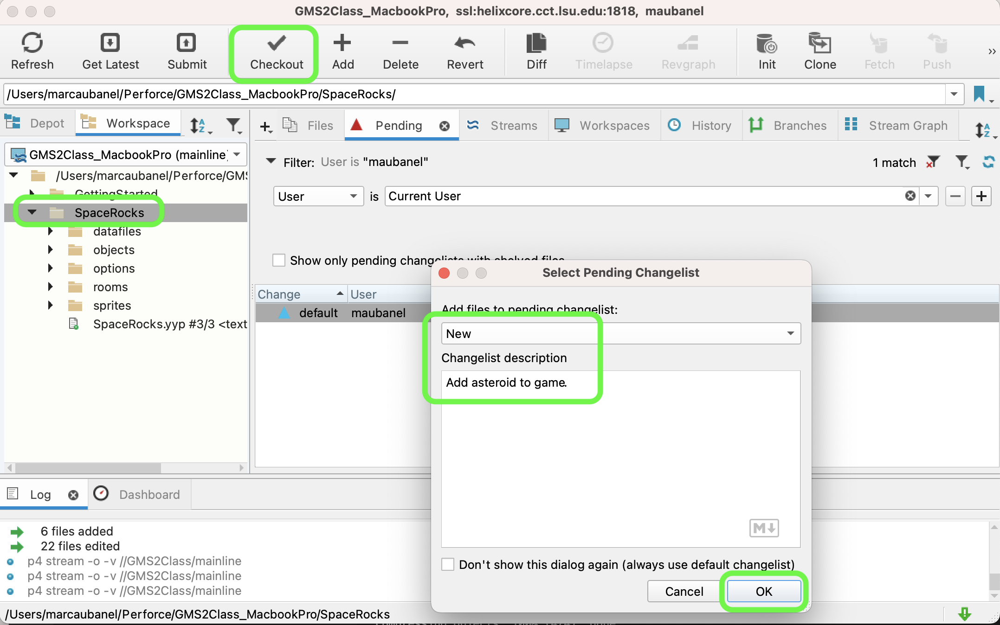

*Right click* 3 times on **Sprites** and select **New | Sprite** and name it `spr_large`, `spr_medium` and `spr_small`.  Make the large `128` by `128`.  Make the medium `64` by `64` and the small at `24` by `24`. Use a white square that is the second thickness from the left.  Use the **Polygon** tool and draw three asteroid shapes. 

##### `Step 2.`\|`FHIU`|:small_blue_diamond: :small_blue_diamond: 

Make sure the **Origin** on all of them is `Middle | Center`.

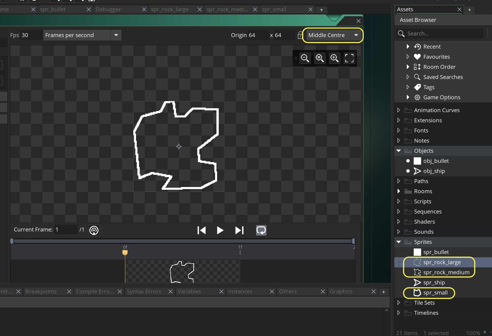

##### `Step 3.`\|`SPCRK`|:small_blue_diamond: :small_blue_diamond: :small_blue_diamond:

*Right click* on **Objects** and select **New | Object** and name it `obj_rock`. Set the **Sprite** to `spr_rock_large`.

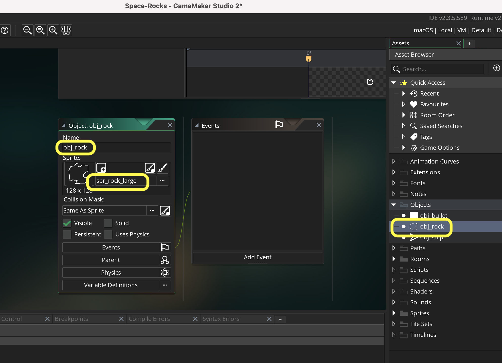

##### `Step 4.`\|`SPCRK`|:small_blue_diamond: :small_blue_diamond: :small_blue_diamond: :small_blue_diamond:

Now we want to spawn new rocks to send to the player just outside the room.  We also want to `move_wrap` the rocks so that when they leave the room they come back on the other side.  Now we don't want a spawned rock to move wrap.  So we want to make sure we spawn within **half a sprite** width of the rock and the `move_wrap` **margin** is a **full** sprite_width.

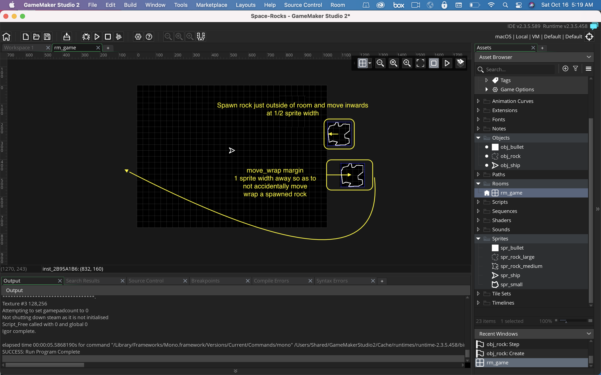

##### `Step 5.`\|`SPCRK`| :small_orange_diamond:

Press the <kbd>Add Event</kbd> and select a **Create** event.  Remember this only runs once when the rock is created.  Now we will be dealing with the launching of rocks later on so we will put in a temporary **direction** and **speed**.  We will also need a variable to hold the **width** of the sprite which will help us with the margin we will need in the `move_wrap`.  
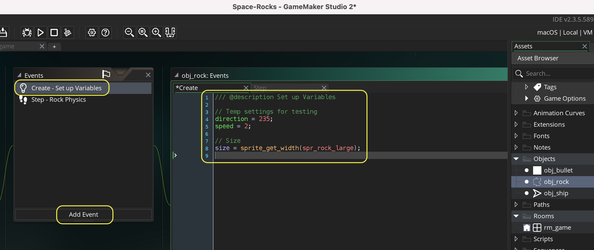

##### `Step 6.`\|`SPCRK`| :small_orange_diamond: :small_blue_diamond:

Press the <kbd>Add Event</kbd> and select a **Step | Step** event. Now we will want to rotate the sprite `.4` degrees per frame for a slow rotation.  We also want to `move_wrap` both horizontally and vertically with a margin of 1 sprite width.

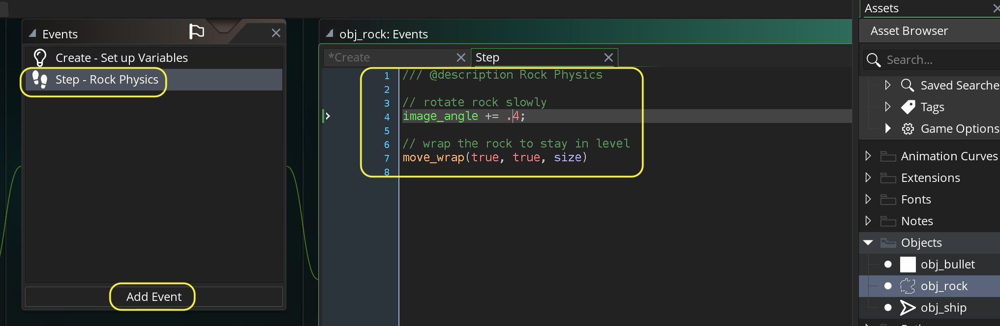

##### `Step 7.`\|`SPCRK`| :small_orange_diamond: :small_blue_diamond: :small_blue_diamond:

Now *press* the <kbd>Play</kbd> button in the top menu bar to launch the game. Now the rock should rotate and move but there is no collision with ship or with bullets.  Lets do this next.

##### `Step 8.`\|`SPCRK`| :small_orange_diamond: :small_blue_diamond: :small_blue_diamond: :small_blue_diamond:

Lets open up **obj_rock** and press the <kbd>Add Event</kbd> button and add a **Collision | obj_bullet** event.  A collision event runs any time the object type in the calling collision event (obj_rock) collides with a bullet.  You do not want to have two reciprical events (another bullet colliding with rock) as we only need to check the collision once.  We are picking it from the rock as we will want to add some effects from the rocks location during destruction.

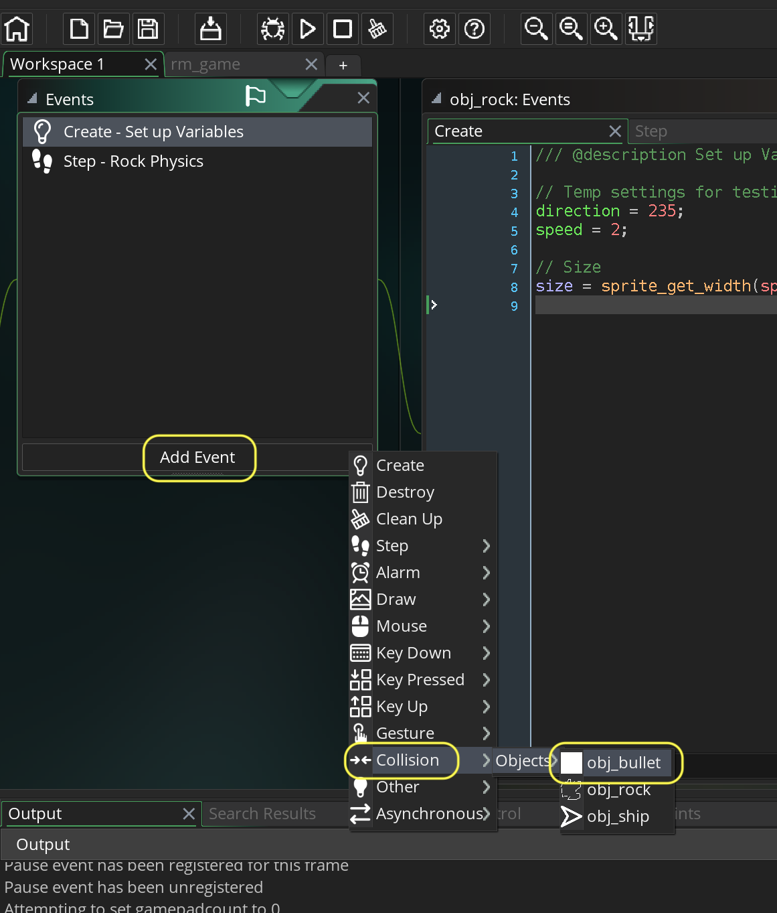

##### `Step 9.`\|`SPCRK`| :small_orange_diamond: :small_blue_diamond: :small_blue_diamond: :small_blue_diamond: :small_blue_diamond:

When the rock gets hit by the bullet we want to destroy both the bullet and the rock.  The first `instance_destroy()` kills the rock. The **[other](https://manual.yoyogames.com/GameMaker_Language/GML_Overview/Instance_Keywords.htm)** keyword is used to access the namespace of the object we are colliding with (just a single instance).  So since we are in the rock this would be a reference to the bullet.  When we use `with(other)` we are entering that object's namespace.  So we can destroy the bullet within the `with` statement. 

> The other instance involved in a collision event, in a with function or in a function. - GameMake Manual

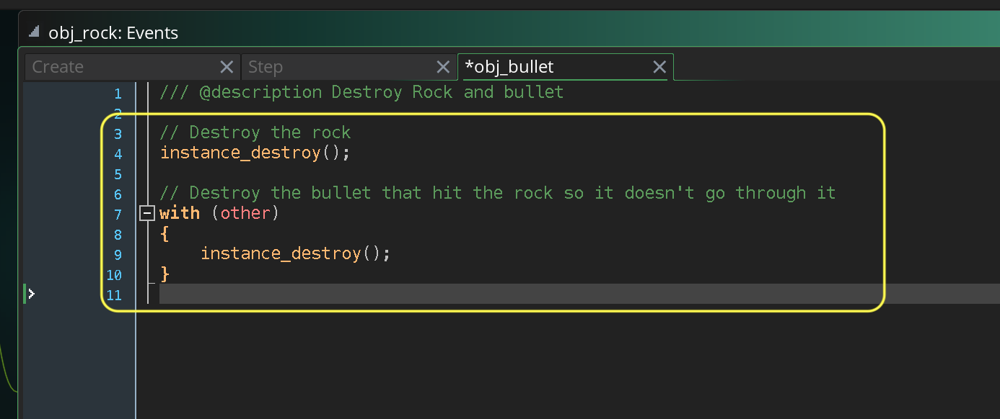

##### `Step 10.`\|`SPCRK`| :large_blue_diamond:

Now *press* the <kbd>Play</kbd> button in the top menu bar to launch the game. Now shoot the rock with the bullet and it will destroy the bullet and the rock.  Now this is very unsatisfying as we do not get a lot of positive feedback for blowing up this giant rock.  Lets address that.

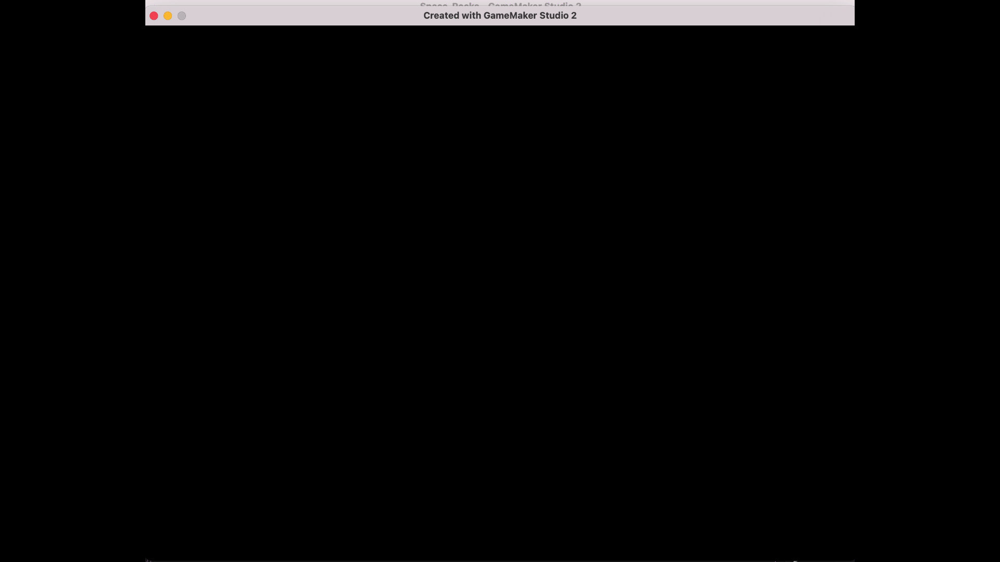

##### `Step 11.`\|`SPCRK`| :large_blue_diamond: :small_blue_diamond: 

*Right click* on **Sprites** and select **New | Sprite** and name it `spr_explosion`. Select the **Size** icon and change the size to `2` by `2`.  *Right click* on **Objects** and select **New | Object** and name it `obj_explosion`. Set the **Sprite** to `spr_explosion`.

##### `Step 12.`\|`SPCRK`| :large_blue_diamond: :small_blue_diamond: :small_blue_diamond: 

Open up **spr_explosion** and select <kbd>Edit Sprite</kbd>.  Select the **Paint Bucket** and fill the sprite with a white color.

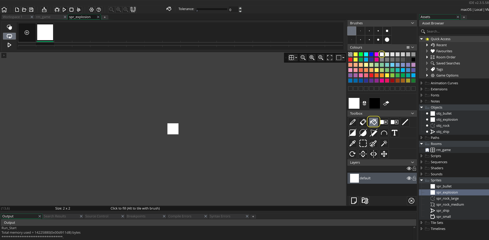

##### `Step 13.`\|`SPCRK`| :large_blue_diamond: :small_blue_diamond: :small_blue_diamond:  :small_blue_diamond: 

Open up **obj_rock | Collision | obj_bullet** and add to the bottom 40 explosions.  Put it at a **depth** of 5 so that it is behind everything else on the screen.

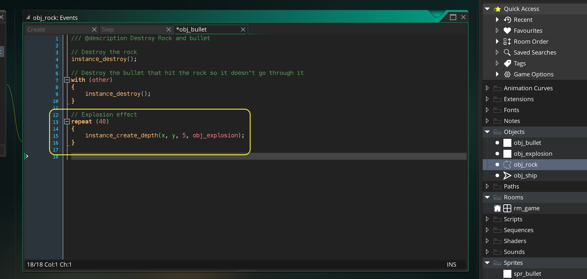

##### `Step 14.`\|`SPCRK`| :large_blue_diamond: :small_blue_diamond: :small_blue_diamond: :small_blue_diamond:  :small_blue_diamond: 

Open up **obj_explosion** and press the <kbd>Add Event</kbd> button and select a **Create** event.  We will send the rock in a random direction between 0 and 359 degrees (0 is the same as 360).  We use **[irandom_range(n1, n2)](https://manual.yoyogames.com/GameMaker_Language/GML_Reference/Maths_And_Numbers/Number_Functions/irandom_range.htm)**.

> This function is similar to random_range() only with integer values as the input. You supply the low value for the range as well as the high value, and the function will return a random integer value within (and including) the given range. For example, irandom_range(10, 35) will return an integer between 10 and 35 inclusive. - GameMaker Manual

We will also use **[random_range(n1, n2)](https://manual.yoyogames.com/GameMaker_Language/GML_Reference/Maths_And_Numbers/Number_Functions/random_range.htm)** for the speed of the player.  This returns a fractional value between the two numbers.

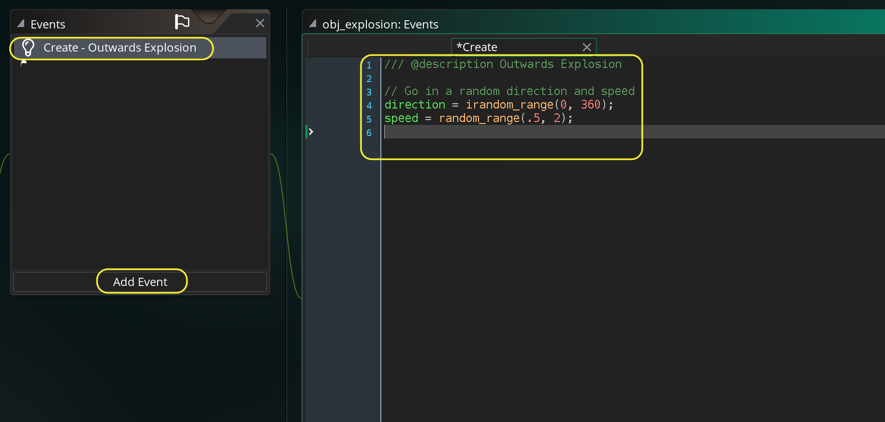

##### `Step 15.`\|`SPCRK`| :large_blue_diamond: :small_orange_diamond: 

Press the <kbd>Add Event</kbd> and select a **Step | Step** event. We will now adjust the **[image_alpha](https://manual.yoyogames.com/GameMaker_Language/GML_Reference/Asset_Management/Sprites/Sprite_Instance_Variables/image_alpha.htm)**.

> This variable (image_alpha) is used to get or to set the alpha value for the sprite. Alpha is always calculated as a value between 0 and 1 where 0 is completely transparent and 1 is completely opaque. 

We will fade it out over 1 second.  We calculate this by dividing `1/room_speed`. We will use the **[room_speed](https://manual.yoyogames.com/GameMaker_Language/GML_Reference/Asset_Management/Rooms/room_speed.htm)** to get an exact timing of one second.

> This variable (room_speed) holds the running speed of all rooms (and the game) in game frames per second. Note that this is NOT the FPS (frames per second) but rather the number of game steps that GameMaker Studio 2 will try to maintain each second.

We will subtract this fraction from the **image_alpha** which will fade the sprite out.  We then check to see if it as at `<=0` and since it is now invisible destroy the object so it no longer takes up memory. 

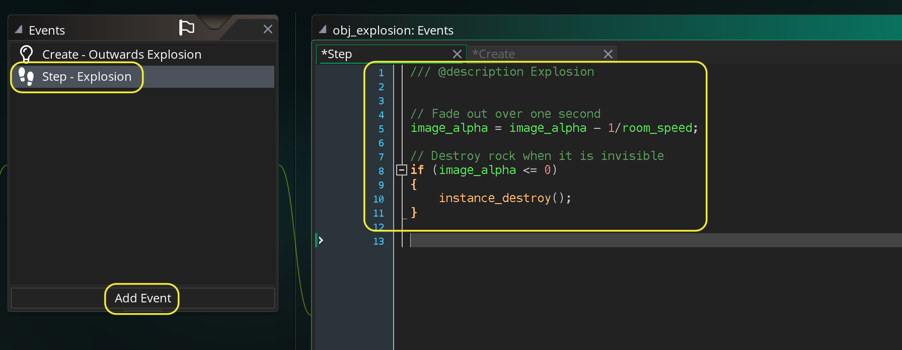

##### `Step 16.`\|`SPCRK`| :large_blue_diamond: :small_orange_diamond:   :small_blue_diamond: 

Now *press* the <kbd>Play</kbd> button in the top menu bar to launch the game. Press the <kbd>Space Bar</kbd> and destroy the rock.  Watch it explode, much better!

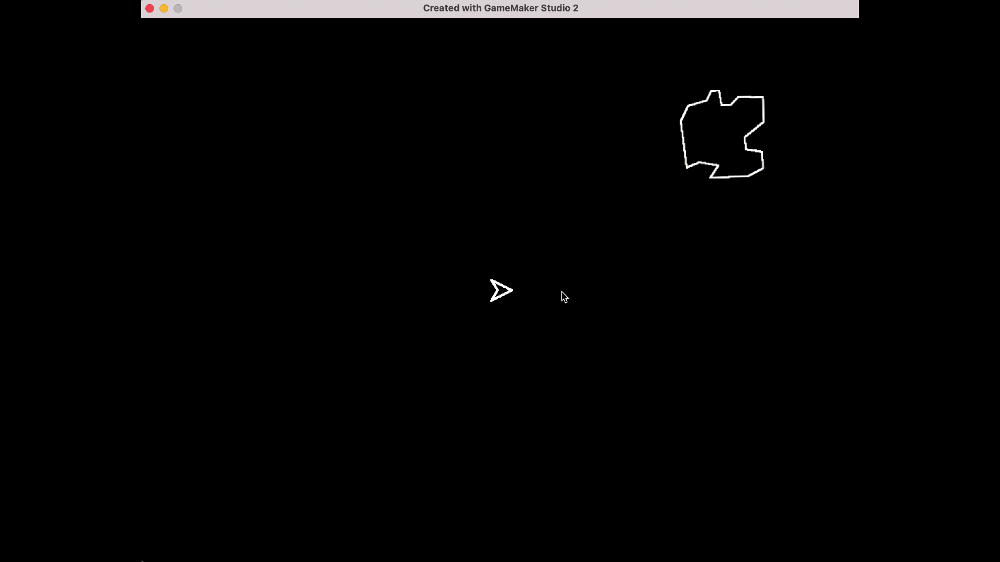

##### `Step 17.`\|`SPCRK`| :large_blue_diamond: :small_orange_diamond: :small_blue_diamond: :small_blue_diamond:

Now we need to destroy the ship when the rock hits it.  Open up **obj_ship** and press the <kbd>Add Event</kbd> and select a **Collision | obj_rock** event. We will then destroy both the rock and the ship.

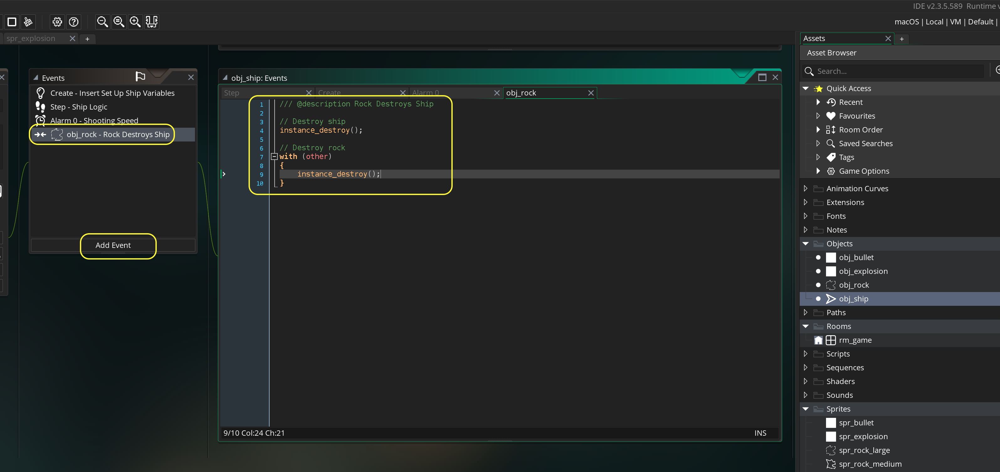

##### `Step 18.`\|`SPCRK`| :large_blue_diamond: :small_orange_diamond: :small_blue_diamond: :small_blue_diamond: :small_blue_diamond:

Now *press* the <kbd>Play</kbd> button in the top menu bar to launch the game. Run into the rock with teh ship.  Notice that they both are destroyed.  It looks like it is destroyed before I hit the rock.  Lets adjust the collision volumes as the default is to take the entire square.

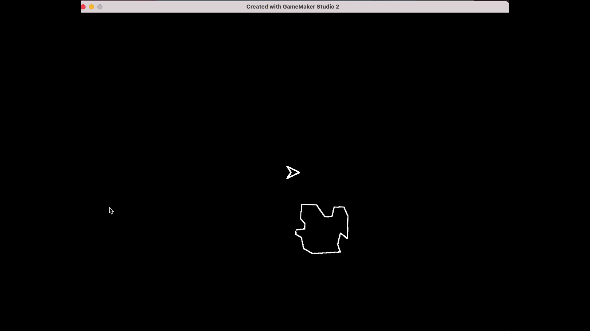

##### `Step 19.`\|`SPCRK`| :large_blue_diamond: :small_orange_diamond: :small_blue_diamond: :small_blue_diamond: :small_blue_diamond: :small_blue_diamond:

Now we do not want the default collision volume. We want to set it inside the sprite so the player can graze off of the edge and not get killed.  We want a clean hit so making collisions smaller is one way of accomplishing this.  Press the **Collision Mask** and change the **Mode** to `Manual` and the **Type** top `Ellipse(Slow)`.  Then adjust the **Left**, **Right**, **Top** and **Bottom** on all three rock sprites.  Make the circle fit inside the lines to the best you can and leave the collisions a bit smaller than you think.

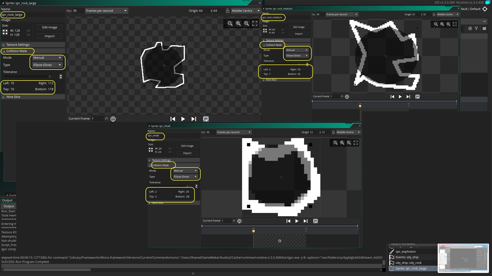

##### `Step 20.`\|`SPCRK`| :large_blue_diamond: :large_blue_diamond:

Now *press* the <kbd>Play</kbd> button in the top menu bar to launch the game. Now you need to be a bit closer to the rock to be destroyed.  Tune the collision to your liking.

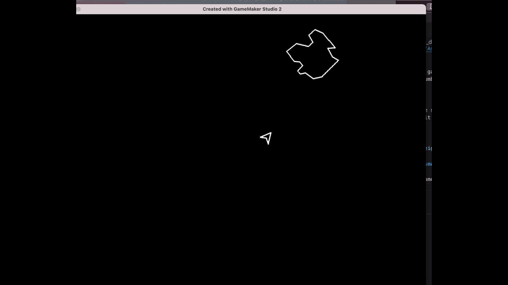

##### `Step 21.`\|`SPCRK`| :large_blue_diamond: :large_blue_diamond: :small_blue_diamond:

Open up **obj_ship | Collision | obj_bullet** and inside the **with(other)** spawn 40 explosions.  We need to do this *inside* the `with` as we want it to spawn from the middle of the rock and NOT the ship.  So this accesses the `other` object we are colliding with so in this case the rock.

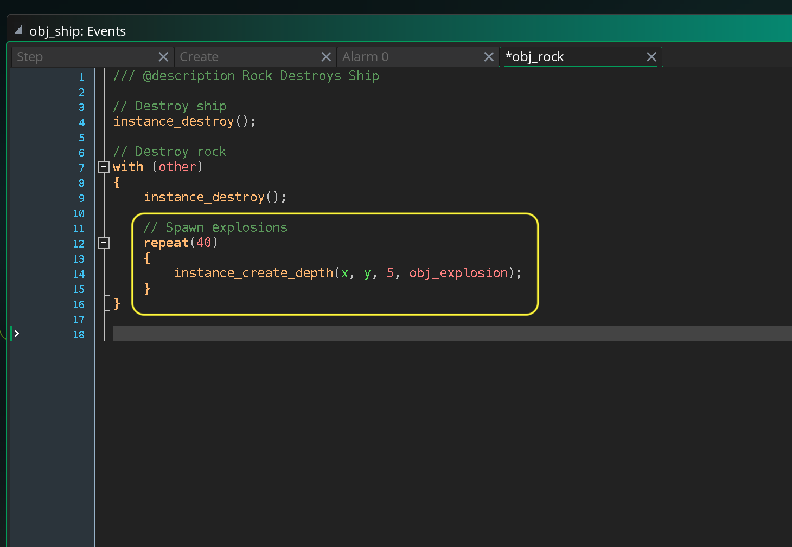

___

| [previous](../shooting/README.md#user-content-shooting)| [home](../README.md#user-content-gms2-ue4-space-rocks) | [next](../asteroids-ii/README.md#user-content-asteroids-ii)|
|---|---|---|
