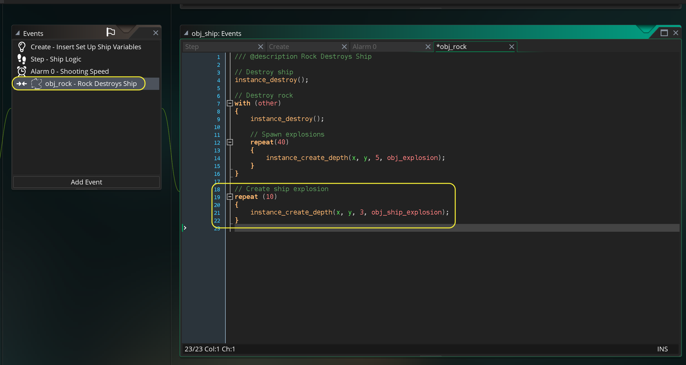
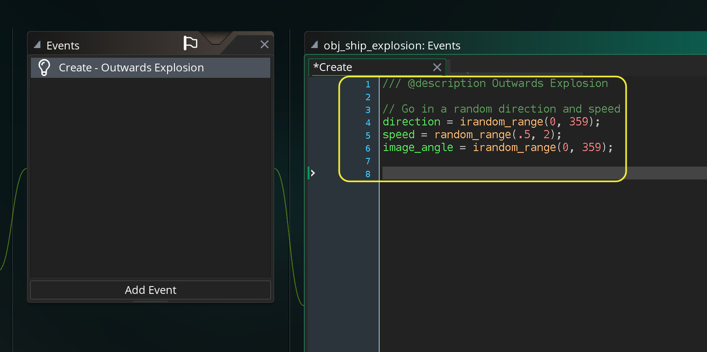
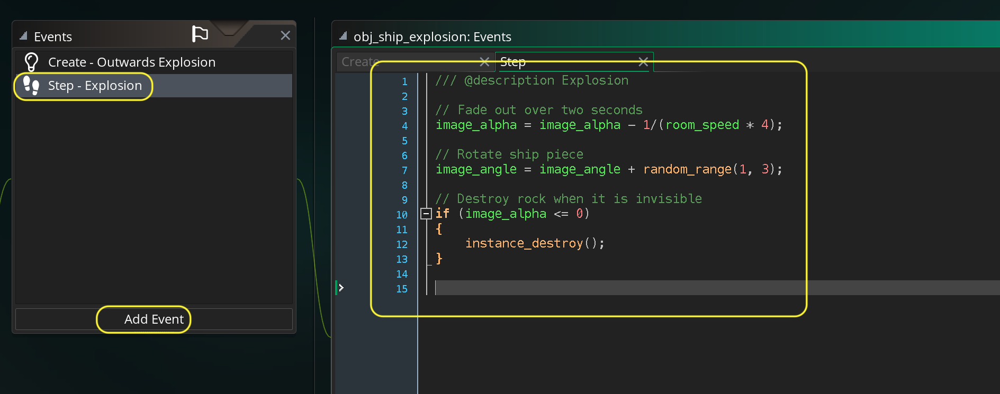
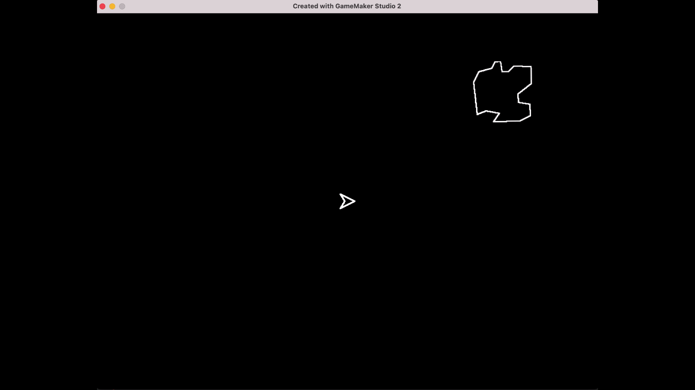

### Asteroids II

[previous](../asteroids-i/README.md#user-content-asteroids-i) • [home](../README.md#user-content-gms2-ue4-space-rocks) • [next](../next-size/README.md#user-content-spawn-next-size-rock)

Lets finish up with the asteroid colliding with the player.

 

---

##### `Step 1.`\|`SPCRK`|:small_blue_diamond:

Now *press* the <kbd>Play</kbd> button in the top menu bar to launch the game. Now run into the rock and see the rock spray!

##### `Step 2.`\|`FHIU`|:small_blue_diamond: :small_blue_diamond: 

We can do better.  Lets add an exploding ship and have it last longer to rub in the death a little bit.

*Right click* on **Sprites** and select **New | Sprite** and name it `spr_ship_explosion`. Change the size to `1` by `8`.  Press the <kbd>Edit Image</kbd> and use the **Fill** tool to make it a white line.  *Right click* on **Objects** and select **New | Object** and name it `obj_ship_explosion`. Set the **Sprite** to `spr_ship_explosion``. 

##### `Step 3.`\|`SPCRK`|:small_blue_diamond: :small_blue_diamond: :small_blue_diamond:

Open up **obj_ship | Collision | obj_rock** and add the ship explosions to the bottom of the script.

##### `Step 4.`\|`SPCRK`|:small_blue_diamond: :small_blue_diamond: :small_blue_diamond: :small_blue_diamond:

Now we can have similar code to the exploding rocks.  Open up **obj_ship_explosion**. Press the <kbd>Add Event</kbd> and select a **Create** event. We will be adding an `image_angle` rotation as this is not a simetrical object so we want it to spin moving outwards as well as going in a random direction and speed.

##### `Step 5.`\|`SPCRK`| :small_orange_diamond:

Press the <kbd>Add Event</kbd> and select a **Step | Step** event. Now we will fade it out over 4 seconds so it lasts longer than the rock spray.  We will also rotate the pieces randomly.  We will destroy the objects when they have faded out completely.

##### `Step 6.`\|`SPCRK`| :small_orange_diamond: :small_blue_diamond:

Press the <kbd>Add Event</kbd> and select a **Create** event. Now doesn't that feel much more satisfying?  That is it for the functionality of the asteroids.

##### `Step 7.`\|`SPCRK`| :small_orange_diamond: :small_blue_diamond: :small_blue_diamond:

Select the **File | Save Project** then press **File | Quit** to make sure everything in the game is saved. If you are using **GitHub** open up **GitHub Desktop** and add a title and longer description (if necessary) and press the <kbd>Commit to main</kbd> button. Finish by pressing **Push origin** to update the server with the latest changes.

___

| [previous](../asteroids-i/README.md#user-content-asteroids-i)| [home](../README.md#user-content-gms2-ue4-space-rocks) | [next](../next-size/README.md#user-content-spawn-next-size-rock)|
|---|---|---|
