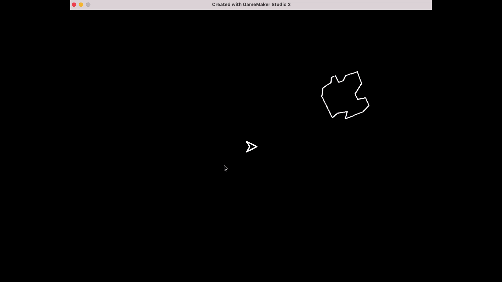
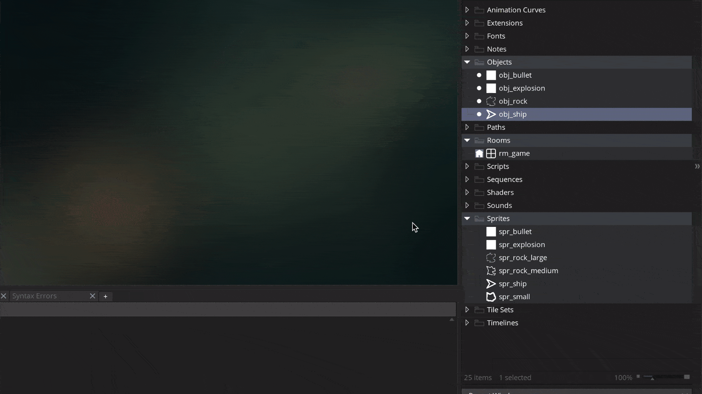

### Asteroids II

[previous](../asteroids-i/README.md#user-content-asteroids-i) • [home](../README.md#user-content-gms2-ue4-space-rocks) • [next](../)

Lets finish up with the asteroid colliding with the player.

 

---

##### `Step 1.`\|`SPCRK`|:small_blue_diamond:

Now *press* the <kbd>Play</kbd> button in the top menu bar to launch the game. Now run into the rock and see the rock spray!

##### `Step 2.`\|`FHIU`|:small_blue_diamond: :small_blue_diamond: 

We can do better.  Lets add an exploding ship and have it last longer to rub in the death a little bit.

*Right click* on **Sprites** and select **New | Sprite** and name it `spr_ship_explosion`. Change the size to `1` by `8`.  Press the <kbd>Edit Image</kbd> and use the **Fill** tool to make it a white line.  *Right click* on **Objects** and select **New | Object** and name it `obj_ship_explosion`. Set the **Sprite** to `spr_ship_explosion``. 

##### `Step 3.`\|`SPCRK`|:small_blue_diamond: :small_blue_diamond: :small_blue_diamond:

##### `Step 4.`\|`SPCRK`|:small_blue_diamond: :small_blue_diamond: :small_blue_diamond: :small_blue_diamond:

##### `Step 5.`\|`SPCRK`| :small_orange_diamond:

##### `Step 6.`\|`SPCRK`| :small_orange_diamond: :small_blue_diamond:

##### `Step 7.`\|`SPCRK`| :small_orange_diamond: :small_blue_diamond: :small_blue_diamond:

##### `Step 8.`\|`SPCRK`| :small_orange_diamond: :small_blue_diamond: :small_blue_diamond: :small_blue_diamond:

##### `Step 9.`\|`SPCRK`| :small_orange_diamond: :small_blue_diamond: :small_blue_diamond: :small_blue_diamond: :small_blue_diamond:

##### `Step 10.`\|`SPCRK`| :large_blue_diamond:

##### `Step 11.`\|`SPCRK`| :large_blue_diamond: :small_blue_diamond: 

##### `Step 12.`\|`SPCRK`| :large_blue_diamond: :small_blue_diamond: :small_blue_diamond: 

##### `Step 13.`\|`SPCRK`| :large_blue_diamond: :small_blue_diamond: :small_blue_diamond:  :small_blue_diamond: 

##### `Step 14.`\|`SPCRK`| :large_blue_diamond: :small_blue_diamond: :small_blue_diamond: :small_blue_diamond:  :small_blue_diamond: 

##### `Step 15.`\|`SPCRK`| :large_blue_diamond: :small_orange_diamond: 

##### `Step 16.`\|`SPCRK`| :large_blue_diamond: :small_orange_diamond:   :small_blue_diamond: 

##### `Step 17.`\|`SPCRK`| :large_blue_diamond: :small_orange_diamond: :small_blue_diamond: :small_blue_diamond:

##### `Step 18.`\|`SPCRK`| :large_blue_diamond: :small_orange_diamond: :small_blue_diamond: :small_blue_diamond: :small_blue_diamond:

##### `Step 19.`\|`SPCRK`| :large_blue_diamond: :small_orange_diamond: :small_blue_diamond: :small_blue_diamond: :small_blue_diamond: :small_blue_diamond:

##### `Step 20.`\|`SPCRK`| :large_blue_diamond: :large_blue_diamond:

##### `Step 21.`\|`SPCRK`| :large_blue_diamond: :large_blue_diamond: :small_blue_diamond:

___

| [previous](../asteroids-i/README.md#user-content-asteroids-i)| [home](../README.md#user-content-gms2-ue4-space-rocks) | [next](../)|
|---|---|---|
