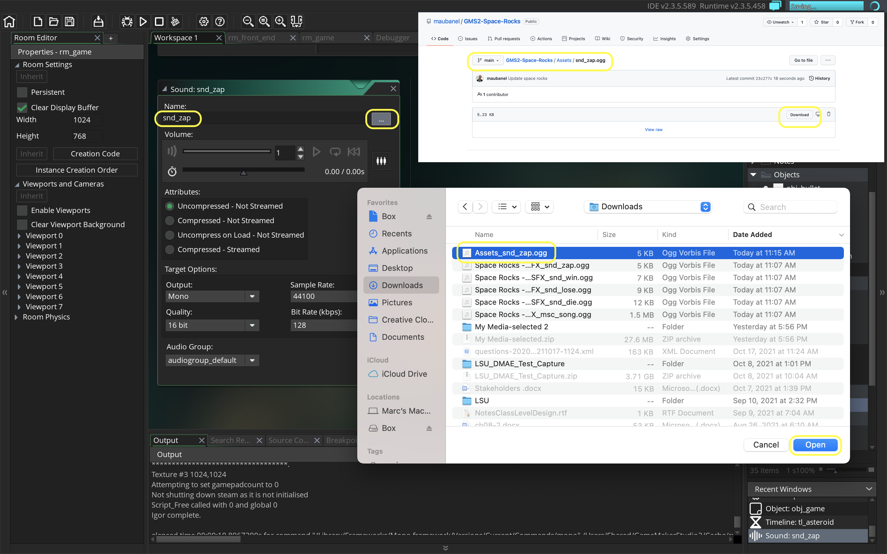
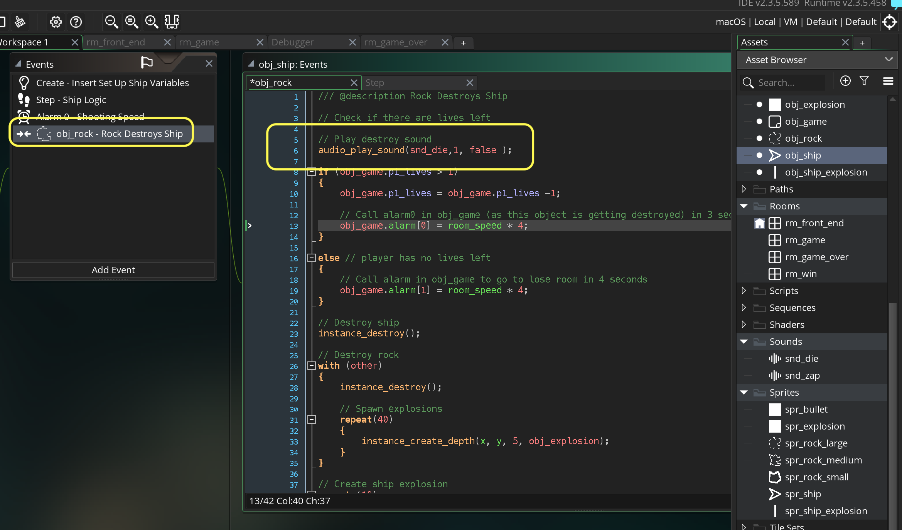

### Audio

[previous](../waves/README.md#user-content-launch-waves) • [home](../README.md#user-content-gms2-ue4-space-rocks)

After you have completed the game loop and added escalation, we can put the finishing touch with adding audio to the game. 

 

---

##### `Step 1.`\|`SPCRK`|:small_blue_diamond:

Lets add a shooting sound effect.  Download the [snd_zap.ogg](../Assets/snd_zap.ogg) file.  *Right click* on **Sounds** and select **Create Sound**.  Call the file `snd_zap`.  Press the <kbd>...</kbd> button and select the file you just downloaded **snd_zap.ogg**. Press the <kbd>Play</kbd> button and hear the sound it should make.

##### `Step 2.`\|`FHIU`|:small_blue_diamond: :small_blue_diamond: 

Where does the shooting take place. It is in the **obj_ship | Step** event.  We need to look to where we check to see if the spacebar is pressed.  This is where we will play the sound.  We will be using **[audio_play_sound(index, priority, loop);](https://manual.yoyogames.com/GameMaker_Language/GML_Reference/Asset_Management/Audio/audio_play_sound.htm)**

> With this function you can play any sound resource in your game. You provide the sound index and assign it a priority, which is then used to determine how sounds are dealt with when the number of sounds playing is over the limit set by the function audio_channel_num(). Lower priority sounds will be stopped in favour of higher priority sounds, and the priority value can be any real number (the actual value is arbitrary, and can be from 0 to 1 or 0 to 100, as GameMaker Studio 2 will prioritize them the same). Note that when dealing with priority, the higher the number the higher the priority, such that a sound with priority 100 will be favoured over a sound with priority 1. The final argument is for making the sound loop and setting it to true will make the sound loop until it is stopped and setting it to false will play the sound once only.   This function will also return a unique index number for the sound being played which can then be stored in a variable so that you can then pause it or stop it with the appropriate functions. This means that if you have multiple instances of the same sound playing at any one time you can target just one instance of that sound to deal with using the audio functions. - GameMaker Manual

We will set the **index** to `snd_zap`, the **priority** to `1` (we have more than enough audio channels for this simple game) and `false` to **loop**.  We don't want this sound to loop (typically we would loop music that we want to start over from the begining).

##### `Step 3.`\|`SPCRK`|:small_blue_diamond: :small_blue_diamond: :small_blue_diamond:

Lets add a rock blowing up sound effect.  Download the [snd_die.ogg](../Assets/snd_die.ogg) file. *Right click* on **Sounds** and select **Create Sound**.  Call the file `snd_zdie`.  Press the <kbd>...</kbd> button and select the file you just downloaded **snd_die.ogg**. Press the <kbd>Play</kbd> button and hear the sound it should make when a rock of the spaceship is killed.

##### `Step 4.`\|`SPCRK`|:small_blue_diamond: :small_blue_diamond: :small_blue_diamond: :small_blue_diamond:

Open up **obj_rock | collision | obj_bullet** and add to the top of the collision event this explosion sound.

##### `Step 5.`\|`SPCRK`| :small_orange_diamond:

Now *press* the <kbd>Play</kbd> button in the top menu bar to launch the game. Now you can hear both the shooting and the rocks getting hit.  There is no sound when a rock hits a player.

##### `Step 6.`\|`SPCRK`| :small_orange_diamond: :small_blue_diamond:

Now when the ship collides with the rock we need to make a sound.  Open up **obj_ship | Collision | obj_rock** and add another call to `snd_die` at the top of the script.

##### `Step 7.`\|`SPCRK`| :small_orange_diamond: :small_blue_diamond: :small_blue_diamond:

Lets add some music to the game.  Download the [snd_song.ogg](../Assets/snd_song.ogg) file. *Right click* on **Sounds** and select **Create Sound**.  Call the file `snd_song`.  Press the <kbd>...</kbd> button and select the file you just downloaded **snd_song.ogg**. 

##### `Step 8.`\|`SPCRK`| :small_orange_diamond: :small_blue_diamond: :small_blue_diamond: :small_blue_diamond:

Now open up **obj_game | Room Start** and we want to first check to see if the song is playing.  Since it is on loop and plays indefinitely we don't want to accidentally start another song on top fo one already playing.

We use the function **[audio_is_playing(sound);](https://manual.yoyogames.com/GameMaker_Language/GML_Reference/Asset_Management/Audio/audio_is_playing.htm)**

> This function will check the given sound to see if it is currently playing. It sees if this sound is  playing and the function will return true otherwise it will return false. -GameMaker Manual

So we are checking for the inverse by looking for `!audio_is_playing(snd_song)` so we are looking to see if the sound **IS NOT** playing (`!` means logical not). We are also setting **Loop** to `true` as we want the song to keep playing over and over again.

##### `Step 9.`\|`SPCRK`| :small_orange_diamond: :small_blue_diamond: :small_blue_diamond: :small_blue_diamond: :small_blue_diamond:

Lets add a win and lose track to the game.  Download the [snd_win.ogg](../Assets/snd_win.ogg) and [snd_lose.ogg](../Assets/snd_lose.ogg) files. *Right click* on **Sounds** and select **Create Sound**.  Call the file `snd_win` on the first and `snd_lose` on the second.  Press the two <kbd>...</kbd> button and select the files you just downloaded **snd_win.ogg** & **snd_win.lose**. 

##### `Step 10.`\|`SPCRK`| :large_blue_diamond:

##### `Step 11.`\|`SPCRK`| :large_blue_diamond: :small_blue_diamond: 

##### `Step 12.`\|`SPCRK`| :large_blue_diamond: :small_blue_diamond: :small_blue_diamond: 

##### `Step 13.`\|`SPCRK`| :large_blue_diamond: :small_blue_diamond: :small_blue_diamond:  :small_blue_diamond: 

##### `Step 14.`\|`SPCRK`| :large_blue_diamond: :small_blue_diamond: :small_blue_diamond: :small_blue_diamond:  :small_blue_diamond: 

##### `Step 15.`\|`SPCRK`| :large_blue_diamond: :small_orange_diamond: 

##### `Step 16.`\|`SPCRK`| :large_blue_diamond: :small_orange_diamond:   :small_blue_diamond: 

##### `Step 17.`\|`SPCRK`| :large_blue_diamond: :small_orange_diamond: :small_blue_diamond: :small_blue_diamond:

##### `Step 18.`\|`SPCRK`| :large_blue_diamond: :small_orange_diamond: :small_blue_diamond: :small_blue_diamond: :small_blue_diamond:

##### `Step 19.`\|`SPCRK`| :large_blue_diamond: :small_orange_diamond: :small_blue_diamond: :small_blue_diamond: :small_blue_diamond: :small_blue_diamond:

##### `Step 20.`\|`SPCRK`| :large_blue_diamond: :large_blue_diamond:

##### `Step 21.`\|`SPCRK`| :large_blue_diamond: :large_blue_diamond: :small_blue_diamond:

___

| [previous](../waves/README.md#user-content-launch-waves)| [home](../README.md#user-content-gms2-ue4-space-rocks) |
|---|---|
