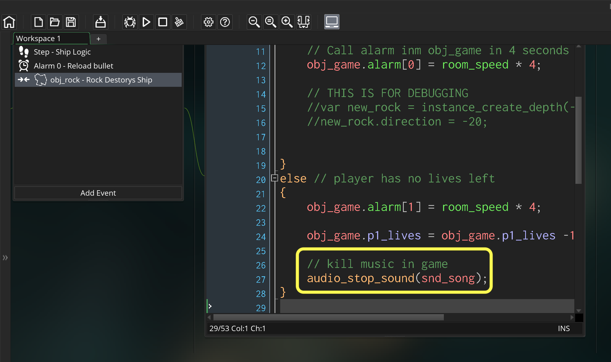
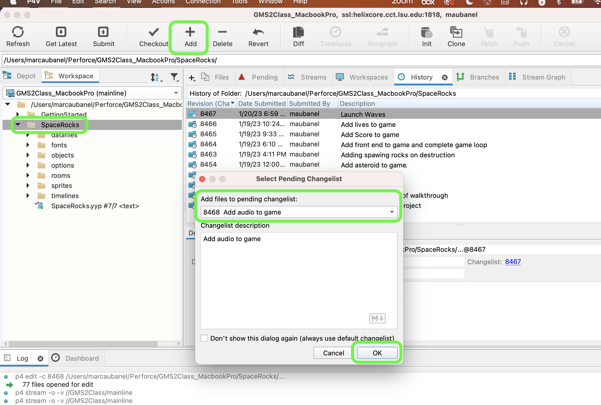
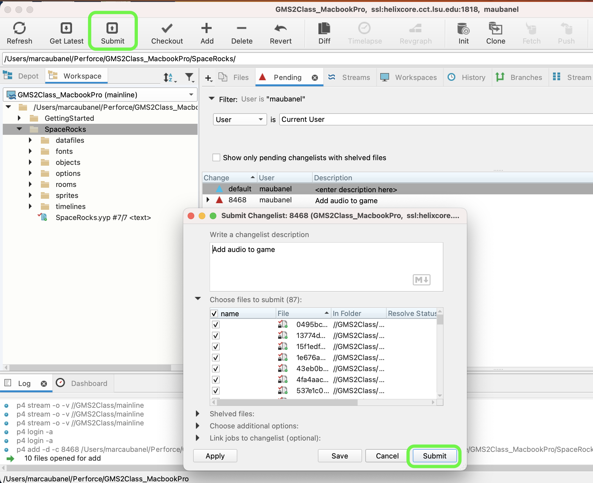

### Audio

[previous](../waves/README.md#user-content-launch-waves) • [home](../README.md#user-content-gms2-ue4-space-rocks)

After you have completed the game loop and added escalation, we can put the finishing touch with adding audio to the game. 

 

---

##### `Step 1.`\|`SPCRK`|:small_blue_diamond:

Open up **P4v**.  Select the top folder of the **GameMaker** project. Press the <kbd>Checkout</kbd> button.  Checkout out all files in P4V so that they are all writable (otherwise they will be read only and none of the changes will be saved). Select a **New** changelist and add a message describing the unit of work you will be performing. Press the <kbd>OK</kbd> button.

Open up the project you are working on in **GameMaker**. 

Lets add a shooting sound effect.  Download the [snd_zap.ogg](../Assets/snd_zap.ogg) file.  *Right click* on **Sounds** and select **Create Sound**.  Call the file `snd_zap`.  Press the <kbd>...</kbd> button and select the file you just downloaded **Assets_snd_zap.ogg**. Press the <kbd>Play</kbd> button and hear the sound it should make.

##### `Step 2.`\|`FHIU`|:small_blue_diamond: :small_blue_diamond: 

Where does the shooting take place. It is in the **obj_ship | Step** event.  We need to look to where we check to see if the spacebar is pressed.  This is where we will play the sound.  We will be using **[audio_play_sound(index, priority, loop);](https://manual.yoyogames.com/GameMaker_Language/GML_Reference/Asset_Management/Audio/audio_play_sound.htm)**

> With this function you can play any sound resource in your game. You provide the sound index and assign it a priority, which is then used to determine how sounds are dealt with when the number of sounds playing is over the limit set by the function audio_channel_num(). Lower priority sounds will be stopped in favour of higher priority sounds, and the priority value can be any real number (the actual value is arbitrary, and can be from 0 to 1 or 0 to 100, as GameMaker Studio 2 will prioritize them the same). Note that when dealing with priority, the higher the number the higher the priority, such that a sound with priority 100 will be favoured over a sound with priority 1. The final argument is for making the sound loop and setting it to true will make the sound loop until it is stopped and setting it to false will play the sound once only.   This function will also return a unique index number for the sound being played which can then be stored in a variable so that you can then pause it or stop it with the appropriate functions. This means that if you have multiple instances of the same sound playing at any one time you can target just one instance of that sound to deal with using the audio functions. - GameMaker Manual

We will set the **index** to `snd_zap`, the **priority** to `1` (we have more than enough audio channels for this simple game) and `false` to **loop**.  We don't want this sound to loop (typically we would loop music that we want to start over from the begining).

##### `Step 3.`\|`SPCRK`|:small_blue_diamond: :small_blue_diamond: :small_blue_diamond:

Now *press* the <kbd>Play</kbd> button in the top menu bar to launch the game. Press the <kbd>Space Bar</kbd> and you should have a shooting sound. Make sure you unmute the video to hear what it should sound like.

https://user-images.githubusercontent.com/5504953/138128316-6f23ebba-bcbe-4fe1-83b9-36b10ee8c986.mp4

##### `Step 4.`\|`SPCRK`|:small_blue_diamond: :small_blue_diamond: :small_blue_diamond: :small_blue_diamond:

Lets add a rock blowing up sound effect.  Download the [snd_die.ogg](../Assets/snd_die.ogg) file. *Right click* on **Sounds** and select **Create Sound**.  Call the file `snd_zdie`.  Press the <kbd>...</kbd> button and select the file you just downloaded **snd_die.ogg**. Press the <kbd>Play</kbd> button and hear the sound it should make when a rock of the spaceship is killed.

##### `Step 5.`\|`SPCRK`| :small_orange_diamond:

Open up **obj_rock | collision | obj_bullet** and add to the top of the collision event this explosion sound.

##### `Step 6.`\|`SPCRK`| :small_orange_diamond: :small_blue_diamond:

Now *press* the <kbd>Play</kbd> button in the top menu bar to launch the game. Now you can hear both the shooting and the rocks getting hit.  There is no sound when a rock hits a player.

https://user-images.githubusercontent.com/5504953/138130572-c5738019-bc33-4bb0-97ec-c44ead954c73.mp4

##### `Step 7.`\|`SPCRK`| :small_orange_diamond: :small_blue_diamond: :small_blue_diamond:

Now when the ship collides with the rock we need to make a sound.  Open up **obj_ship | Collision | obj_rock** and add another call to `snd_die` at the top of the script.

##### `Step 8.`\|`SPCRK`| :small_orange_diamond: :small_blue_diamond: :small_blue_diamond: :small_blue_diamond:

Now *press* the <kbd>Play</kbd> button in the top menu bar to launch the game. Now you can hear both the shooting and the rocks getting hit.  There is no sound when a rock hits a player.

https://user-images.githubusercontent.com/5504953/138130661-289f0c11-0398-4d6a-a80d-886f393f494c.mp4

##### `Step 9.`\|`SPCRK`| :small_orange_diamond: :small_blue_diamond: :small_blue_diamond: :small_blue_diamond: :small_blue_diamond:

Lets add some music to the game.  Download the [snd_song.ogg](../Assets/snd_song.ogg) file. *Right click* on **Sounds** and select **Create Sound**.  Call the file `snd_song`.  Press the <kbd>...</kbd> button and select the file you just downloaded **snd_song.ogg**. 

##### `Step 10.`\|`SPCRK`| :large_blue_diamond:

Now open up **obj_game | Room Start** and we want to first check to see if the song is playing.  Since it is on loop and plays indefinitely we don't want to accidentally start another song on top fo one already playing.

We use the function **[audio_is_playing(sound);](https://manual.yoyogames.com/GameMaker_Language/GML_Reference/Asset_Management/Audio/audio_is_playing.htm)**

> This function will check the given sound to see if it is currently playing. It sees if this sound is  playing and the function will return true otherwise it will return false. -GameMaker Manual

So we are checking for the inverse by looking for `!audio_is_playing(snd_song)` so we are looking to see if the sound **IS NOT** playing (`!` means logical not). We are also setting **Loop** to `true` as we want the song to keep playing over and over again.

##### `Step 11.`\|`SPCRK`| :large_blue_diamond: :small_blue_diamond: 

Now *press* the <kbd>Play</kbd> button in the top menu bar to launch the game. Notice that we have music that goes from room to room!

https://user-images.githubusercontent.com/5504953/138132003-3ca06d00-e704-47ea-aa56-147ca35a8f89.mp4

##### `Step 12.`\|`SPCRK`| :large_blue_diamond: :small_blue_diamond: :small_blue_diamond: 

Lets add a win and lose track to the game.  Download the [snd_win.ogg](../Assets/snd_win.ogg) and [snd_lose.ogg](../Assets/snd_lose.ogg) files. *Right click* on **Sounds** and select **Create Sound**.  Call the file `snd_win` on the first and `snd_lose` on the second.  Press the two <kbd>...</kbd> button and select the files you just downloaded **snd_win.ogg** & **snd_win.lose**. 

##### `Step 13.`\|`SPCRK`| :large_blue_diamond: :small_blue_diamond: :small_blue_diamond:  :small_blue_diamond: 

You should now have a proper win condition so go to the **obj_game | Step** event and stop playing the song. Then we will start playing the win track in the win room. I uncommented mine back out just so it will play.

##### `Step 14.`\|`SPCRK`| :large_blue_diamond: :small_blue_diamond: :small_blue_diamond: :small_blue_diamond:  :small_blue_diamond: 

Now open up **obj_game | Alarm2** where we switch to the win room and play the win song and don't have it loop.

##### `Step 15.`\|`SPCRK`| :large_blue_diamond: :small_orange_diamond: 

Now *press* the <kbd>Play</kbd> button in the top menu bar to launch the game. Now you should hear the win music when the win condition is achieved.

https://user-images.githubusercontent.com/5504953/138135502-d3daee86-30b9-4c4d-901a-5c67c2907df9.mp4

##### `Step 16.`\|`SPCRK`| :large_blue_diamond: :small_orange_diamond:   :small_blue_diamond: 

Now add the lose sound when you go to the **You Lose!** screen. Open up **obj_game | Alarm1** and add this before changing rooms.

##### `Step 17.`\|`SPCRK`| :large_blue_diamond: :small_orange_diamond: :small_blue_diamond: :small_blue_diamond:

Open up **obj_ship | Collision | obj_rock** and kill the song when the player has run out of lives.

##### `Step 18.`\|`SPCRK`| :large_blue_diamond: :small_orange_diamond: :small_blue_diamond: :small_blue_diamond: :small_blue_diamond:

Now *press* the <kbd>Play</kbd> button in the top menu bar to launch the game. Now you should hear the lose music when you run out of lives.

https://user-images.githubusercontent.com/5504953/138133539-872be4c2-a614-4849-8e35-352dc6b6eaef.mp4

##### `Step 19.`\|`SPCRK`| :large_blue_diamond: :small_orange_diamond: :small_blue_diamond: :small_blue_diamond: :small_blue_diamond: :small_blue_diamond:

Select the **File | Save Project**, then press **File | Quit** (PC) **Game Maker | Quit** on Mac to make sure everything in the game is saved.

##### `Step 20.`\|`SPCRK`| :large_blue_diamond: :large_blue_diamond:

Open up **P4V**.  Select the top folder and press the **Add** button.  We want to add all the new files we created during this last session.  Add these files to the last change list you used at the begining of the session (in my case it was `Spaceship I portion of walkthrough`). Press the <kbd>OK</kbd> button.

##### `Step 21.`\|`SPCRK`| :large_blue_diamond: :large_blue_diamond: :small_blue_diamond:

Now you can submit the changelist by pressing both <kbd>Submit</kbd> buttons.

| `gms2.space.rocks`\|`THE END`| 
| :--- |
| **That's All Folks!** That's it for space rocks. |

<!--  -->

| [previous](../waves/README.md#user-content-launch-waves)| [home](../README.md#user-content-gms2-ue4-space-rocks) |
|---|---|
