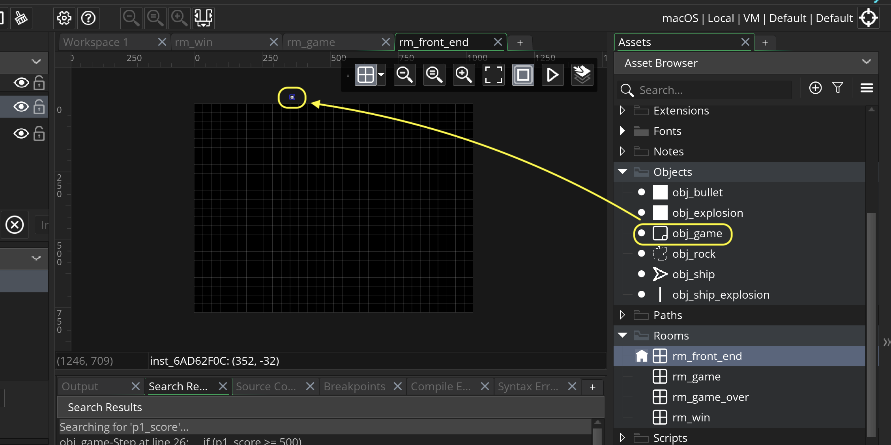
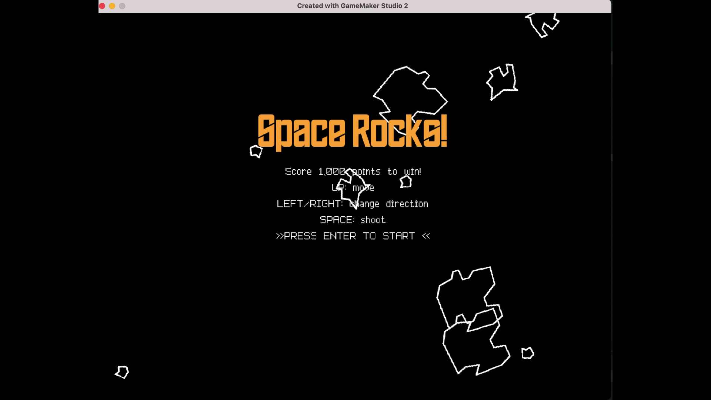

### Front End

[previous](../next-size/README.md#user-content-spawn-next-size-rock) • [home](../README.md#user-content-gms2-ue4-space-rocks) • [next](../score/README.md#user-content-score)

Lets look at implementing a start screen. Lets have some rocks floating in the background with a title and instructions on how to play the game.

 

---

##### `Step 1.`\|`SPCRK`|:small_blue_diamond:

Open up **P4v**.  Select the top folder of the **GameMaker** project. Press the <kbd>Checkout</kbd> button.  Checkout out all files in P4V so that they are all writable (otherwise they will be read only and none of the changes will be saved). Select a **New** changelist and add a message describing the unit of work you will be performing. Press the <kbd>OK</kbd> button.

Open up the project you are working on in **GameMaker**. 

*Right click* on **Rooms** and select **New | Room** and name it `rm_front_end`. Change the **Room Order** to place this room on the top of the list. Change the **Width** to `1024`.

##### `Step 2.`\|`FHIU`|:small_blue_diamond: :small_blue_diamond: 

*Right click* on **Objects** and select **New | Object** and name it `obj_game`. Press the <kbd>Add Event</kbd> and select a **Other | Room Start** event. This will run once each time a room is changed.  This object will be used to control all game states. 

Drag **obj_game** into **rm_front_end**.

##### `Step 3.`\|`SPCRK`|:small_blue_diamond: :small_blue_diamond: :small_blue_diamond:

Lets place 10 rocks in the room and randomly send them on their way. First lets make sure we are in the front end room (in other game rooms we will not want to spawn more rocks);

##### `Step 4.`\|`SPCRK`|:small_blue_diamond: :small_blue_diamond: :small_blue_diamond: :small_blue_diamond:

Now *press* the <kbd>Play</kbd> button in the top menu bar to launch the game. Now they look a bit silly as they all move at the same speed in the same direction.

##### `Step 5.`\|`SPCRK`| :small_orange_diamond:

In **obj_game | Room Start** randomize the direction the rock moves in as well as the speed.

##### `Step 6.`\|`SPCRK`| :small_orange_diamond: :small_blue_diamond:

Now *press* the <kbd>Play</kbd> button in the top menu bar to launch the game. Now the speed and direction helps but they are all starting at the same angle. Lets change this.

##### `Step 7.`\|`SPCRK`| :small_orange_diamond: :small_blue_diamond: :small_blue_diamond:

Now lets add a random `image_angle` to the rock between `0` and `359`.  This means that they will all start with a different rotation and won't look so uniform.

##### `Step 8.`\|`SPCRK`| :small_orange_diamond: :small_blue_diamond: :small_blue_diamond: :small_blue_diamond:

Now *press* the <kbd>Play</kbd> button in the top menu bar to launch the game. Now the game rocks look a lot more natural.  Lets stop there and move on with some titles for the game.

##### `Step 9.`\|`SPCRK`| :small_orange_diamond: :small_blue_diamond: :small_blue_diamond: :small_blue_diamond: :small_blue_diamond:

Download a [advanced pixel 7 font](../Assets/advanced-pixel-7-font.zip) and a [edge of the galaxy font](../Assets/edge-of-the-galaxy-font.zip). They are both open source and available at [fontspace.com](https://www.fontspace.com).  *Unzip* the folders and you should see:

##### `Step 10.`\|`SPCRK`| :large_blue_diamond:

Double click the fonts to install them on your computer.  On the mac **GameMaker** noticed a change and prompted me to let them load them into the game.  If this doesn't happen save the project then restart the game to get access to these fonts.

##### `Step 11.`\|`SPCRK`| :large_blue_diamond: :small_blue_diamond: 

*Right click* on **Fonts** and select **New | Font** and name it `fnt_title`. Set **Select Font** to `Edge of the Galaxy` with a **Style** of `Regular` and **Size** of `56`.

##### `Step 12.`\|`SPCRK`| :large_blue_diamond: :small_blue_diamond: :small_blue_diamond: 

Open up **obj_game** and press the <kbd>Add Event</kbd> button to add a **Draw | Draw** event to the game. Center the text alignment and make the font orange.  Change to the **fnt_title** you just created.  Draw text in the middle of the room on the **x** and at `200` pixels on the **y** axis `Space Rocks!`. 

##### `Step 13.`\|`SPCRK`| :large_blue_diamond: :small_blue_diamond: :small_blue_diamond:  :small_blue_diamond: 

Now *press* the <kbd>Play</kbd> button in the top menu bar to launch the game. Look at that beautiful title!

##### `Step 14.`\|`SPCRK`| :large_blue_diamond: :small_blue_diamond: :small_blue_diamond: :small_blue_diamond:  :small_blue_diamond: 

*Right click* on **Fonts** and select **New | Font** and name it `fnt_low_res`. Set **Select Font** to `Advanced Pixel 7` with a **Style** of `Regular` and **Size** of `24`.

##### `Step 15.`\|`SPCRK`| :large_blue_diamond: :small_orange_diamond: 

Open up **obj_game | Draw** and change the font to white and to **fnt_low_res**.  Center it on **x** and place it `300` on the **y**.  Add a score goal, instructions for how to play the game and direction sfor how to start.  Please note that `\n` will not print this will be a line return in the game and just move to the next line (like   in html).

##### `Step 16.`\|`SPCRK`| :large_blue_diamond: :small_orange_diamond:   :small_blue_diamond: 

Now *press* the <kbd>Play</kbd> button in the top menu bar to launch the game. Now you should see the instructions we printed above in the game.

##### `Step 17.`\|`SPCRK`| :large_blue_diamond: :small_orange_diamond: :small_blue_diamond: :small_blue_diamond:

Go back to **obj_game** and press the <kbd>Add Event</kbd> and select a **Step | Step** event. Then check to make sure we are in the first room, if we are then we can change rooms to the game!

##### `Step 18.`\|`SPCRK`| :large_blue_diamond: :small_orange_diamond: :small_blue_diamond: :small_blue_diamond: :small_blue_diamond:

Now *press* the <kbd>Play</kbd> button in the top menu bar to launch the game. Now you can move from the front end to the game.

##### `Step 19.`\|`SPCRK`| :large_blue_diamond: :small_orange_diamond: :small_blue_diamond: :small_blue_diamond: :small_blue_diamond: :small_blue_diamond:
 Now we want the **obj_game** to persist from level to level.  We are going to use it for all of our master game logic that transends the front end, game and win/lose screens. But if we run the game in debug mode and look at what instances are in the room, we see it in the **rm_front_end** but not in **rm_game**.  How do we make **obj_game** persist from room to room?

##### `Step 20.`\|`SPCRK`| :large_blue_diamond: :large_blue_diamond:

Open up **obj_game** and set **[persistent](https://manual.yoyogames.com/GameMaker_Language/GML_Reference/Asset_Management/Instances/Instance_Variables/persistent.htm)** to `true`.

> This variable can be read to find out if the instance is flagged as persistent or not, or it can used to set persistence to true (persistent) or false (not persistent) for the instance. A persistent instance is one that will be "carried over" from room to room, meaning (for example) that it only has to be created once at the start of the game and it will be present in all further rooms. Care should be taken with persistence as it is easy to lose track of persistent instances which can lead to problems later in the development of the game. - GameMaker Manual

So we will be careful with this object and it will be the only persistent one in the game.

##### `Step 21.`\|`SPCRK`| :large_blue_diamond: :large_blue_diamond: :small_blue_diamond:

*Press* the **Debug Play** button and look at the **Instances**.  You will notice that now **obj_game** no longer disappears and moves into the **rm_game**.

##### `Step 22.`\|`SPCRK`| :large_blue_diamond: :large_blue_diamond: :small_blue_diamond: :small_blue_diamond:

Select the **File | Save Project**, then press **File | Quit** (PC) **Game Maker | Quit** on Mac to make sure everything in the game is saved.

##### `Step 22.`\|`SPCRK`| :large_blue_diamond: :large_blue_diamond: :small_blue_diamond: :small_blue_diamond:

Open up **P4V**.  Select the top folder and press the **Add** button.  We want to add all the new files we created during this last session.  Add these files to the last change list you used at the begining of the session (in my case it was `Spaceship I portion of walkthrough`). Press the <kbd>OK</kbd> button.

##### `Step 22.`\|`SPCRK`| :large_blue_diamond: :large_blue_diamond: :small_blue_diamond: :small_blue_diamond:

Now you can submit the changelist by pressing both <kbd>Submit</kbd> buttons.

<!--  -->

| [previous](../next-size/README.md#user-content-spawn-next-size-rock)| [home](../README.md#user-content-gms2-ue4-space-rocks) | [next](../score/README.md#user-content-score)|
|---|---|---|
