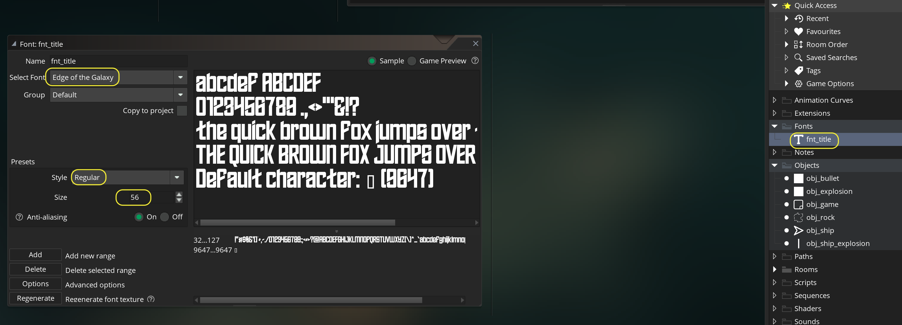
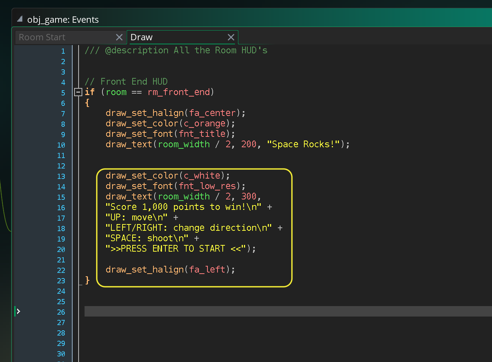

### Main Game Loop

[previous](../next-size/README.md#user-content-spawn-next-size-rock) • [home](../README.md#user-content-gms2-ue4-space-rocks) • [next](../)

Lets look at implementing a start screen, win screen and lose screen.  This way we should be able to complete and restart a game upon completion.

 

---

##### `Step 1.`\|`SPCRK`|:small_blue_diamond:

*Right click* on **Rooms** and select **New | Room** and name it `rm_front_end`. Change the **Room Order** to place this room on the top of the list.

##### `Step 2.`\|`FHIU`|:small_blue_diamond: :small_blue_diamond: 

*Right click* on **Objects** and select **New | Object** and name it `obj_game`. Press the <kbd>Add Event</kbd> and select a **Other | Room Start** event. This will run once each time a room is changed.  This object will be used to control all game states.

##### `Step 3.`\|`SPCRK`|:small_blue_diamond: :small_blue_diamond: :small_blue_diamond:

Lets place 10 rocks in the room and randomly send them on their way. First lets make sure we are in the front end room (in other game rooms we will not want to spawn more rocks);

##### `Step 4.`\|`SPCRK`|:small_blue_diamond: :small_blue_diamond: :small_blue_diamond: :small_blue_diamond:

Now *press* the <kbd>Play</kbd> button in the top menu bar to launch the game. Now they look a bit silly as they all move at the same speed in the same direction.

##### `Step 5.`\|`SPCRK`| :small_orange_diamond:

In **obj_game | Room Start** randomize the direction the rock moves in as well as the speed.

##### `Step 6.`\|`SPCRK`| :small_orange_diamond: :small_blue_diamond:

Now *press* the <kbd>Play</kbd> button in the top menu bar to launch the game. Now the speed and direction helps but they are all starting at the same angle. Lets change this.

##### `Step 7.`\|`SPCRK`| :small_orange_diamond: :small_blue_diamond: :small_blue_diamond:

Now lets add a random `image_angle` to the rock between `0` and `359`.  This means that they will all start with a different rotation and won't look so uniform.

##### `Step 8.`\|`SPCRK`| :small_orange_diamond: :small_blue_diamond: :small_blue_diamond: :small_blue_diamond:

Now *press* the <kbd>Play</kbd> button in the top menu bar to launch the game. Now the game rocks look a lot more natural.  Lets stop there and move on with some titles for the game.

##### `Step 9.`\|`SPCRK`| :small_orange_diamond: :small_blue_diamond: :small_blue_diamond: :small_blue_diamond: :small_blue_diamond:

Download a [advanced pixel 7 font](../Assets/advanced-pixel-7-font.zip) and a [edge of the galaxy font](../Assets/edge-of-the-galaxy-font.zip). They are both open source and available at [fontspace.com](https://www.fontspace.com).  *Unzip* the folders and you should see:

##### `Step 10.`\|`SPCRK`| :large_blue_diamond:

Double click the fonts to install them on your computer.  On the mac **GameMaker** noticed a change and prompted me to let them load them into the game.  If this doesn't happen save the project then restart the game to get access to these fonts.

##### `Step 11.`\|`SPCRK`| :large_blue_diamond: :small_blue_diamond: 

*Right click* on **Fonts** and select **New | Font** and name it `fnt_title`. Set **Select Font** to `Edge of the Galaxy` with a **Style** of `Regular` and **Size** of `56`.

##### `Step 12.`\|`SPCRK`| :large_blue_diamond: :small_blue_diamond: :small_blue_diamond: 

Open up **obj_game** and press the <kbd>Add Event</kbd> button to add a **Draw | Draw** event to the game. Center the text alignment and make the font orange.  Change to the **fnt_title** you just created.  Draw text in the middle of the room on the **x** and at `200` pixels on the **y** axis `Space Rocks!`. 

##### `Step 13.`\|`SPCRK`| :large_blue_diamond: :small_blue_diamond: :small_blue_diamond:  :small_blue_diamond: 

Now *press* the <kbd>Play</kbd> button in the top menu bar to launch the game. Look at that beautiful title!

##### `Step 14.`\|`SPCRK`| :large_blue_diamond: :small_blue_diamond: :small_blue_diamond: :small_blue_diamond:  :small_blue_diamond: 

*Right click* on **Fonts** and select **New | Font** and name it `fnt_low_res`. Set **Select Font** to `Advanced Pixel 7` with a **Style** of `Regular` and **Size** of `24`.

##### `Step 15.`\|`SPCRK`| :large_blue_diamond: :small_orange_diamond: 

##### `Step 16.`\|`SPCRK`| :large_blue_diamond: :small_orange_diamond:   :small_blue_diamond: 

Open up **obj_game | Draw** and change the font to white and to **fnt_low_res**.  Center it on **x** and place it `300` on the **y**.  Add a score goal, instructions for how to play the game and direction sfor how to start.  Please note that `\n` will not print this will be a line return in the game and just move to the next line (like   in html).

##### `Step 17.`\|`SPCRK`| :large_blue_diamond: :small_orange_diamond: :small_blue_diamond: :small_blue_diamond:

##### `Step 18.`\|`SPCRK`| :large_blue_diamond: :small_orange_diamond: :small_blue_diamond: :small_blue_diamond: :small_blue_diamond:

##### `Step 19.`\|`SPCRK`| :large_blue_diamond: :small_orange_diamond: :small_blue_diamond: :small_blue_diamond: :small_blue_diamond: :small_blue_diamond:

##### `Step 20.`\|`SPCRK`| :large_blue_diamond: :large_blue_diamond:

##### `Step 21.`\|`SPCRK`| :large_blue_diamond: :large_blue_diamond: :small_blue_diamond:

___

| [previous](../next-size/README.md#user-content-spawn-next-size-rock)| [home](../README.md#user-content-gms2-ue4-space-rocks) | [next](../)|
|---|---|---|
