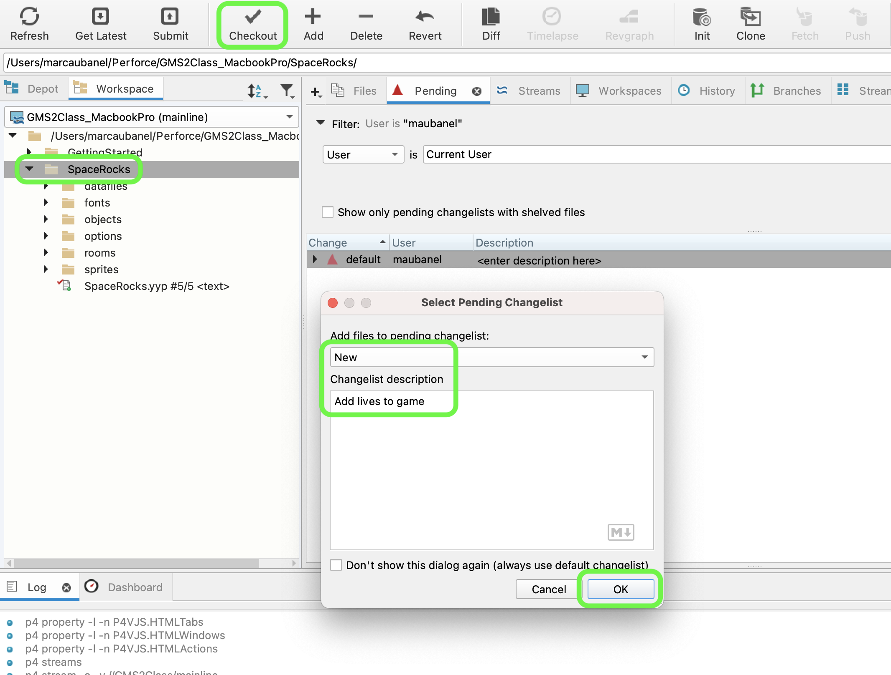
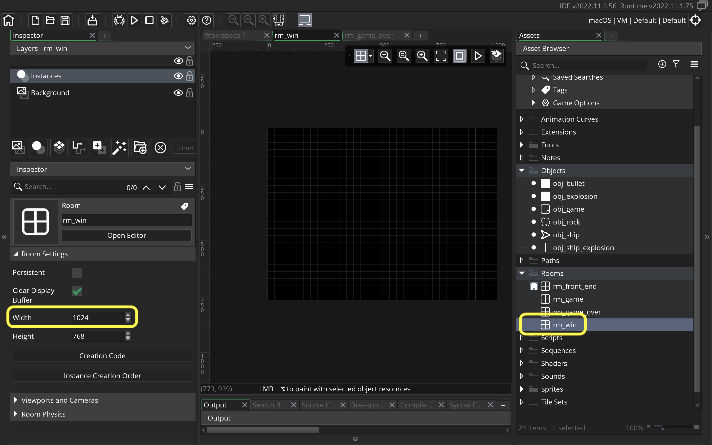
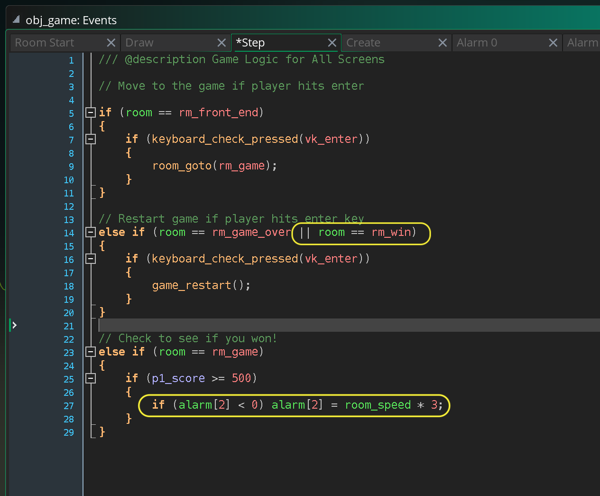
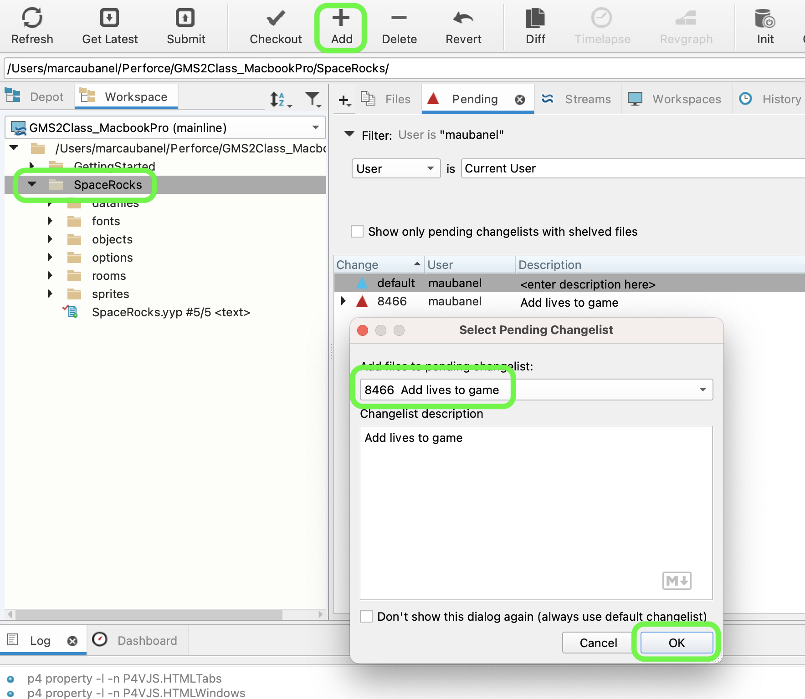
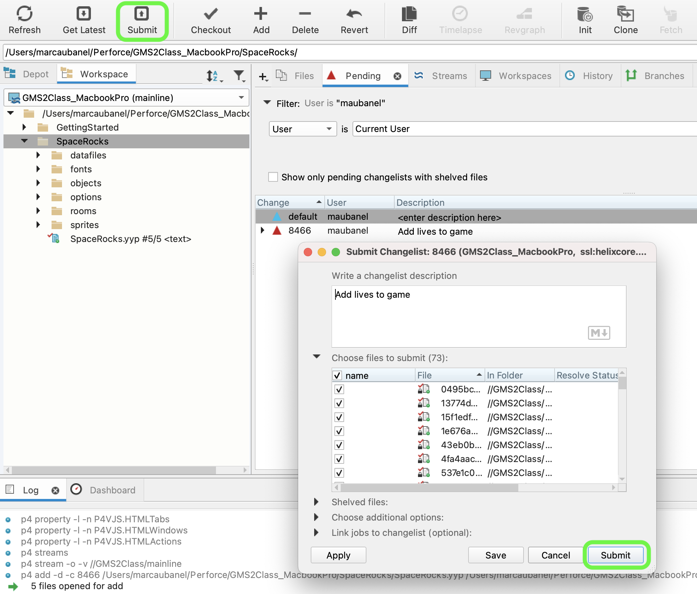

### Lives, Winning and Losing

[previous](../score/README.md#user-content-score) • [home](../README.md#user-content-gms2-ue4-space-rocks) • [next](../waves/README.md#user-content-launch-waves)

Lets deal with getting killed in the game by respawning.  Lets add a certain amount of lives.  If you win go to the win screen and if you lose to the losing screen.

 

---

##### `Step 1.`\|`SPCRK`|:small_blue_diamond:

Open up **P4v**.  Select the top folder of the **GameMaker** project. Press the <kbd>Checkout</kbd> button.  Checkout out all files in P4V so that they are all writable (otherwise they will be read only and none of the changes will be saved). Select a **New** changelist and add a message describing the unit of work you will be performing. Press the <kbd>OK</kbd> button.

Open up the project you are working on in **GameMaker**. 

Open up  **obj_game | Create** event and add a variable `p1_lives` and set the number of player 1 lives to `3`.

##### `Step 2.`\|`FHIU`|:small_blue_diamond: :small_blue_diamond: 

Now go to **obj_ship | Collision | obj_rock** and first check to see if there are lives left.  We need to dot instance into the `obj_game` as we are not inside this object.  We can access its variables this way.  We then subtract one life then call an alarm on **obj_game**.  This is done because the ship will be destroyed and we can't have an alarm on a destroyed objetc (it is destroyed with it). We need an alarm as want to enjoy the ship exploding and we need about 4 seconds for the debris to clear.

##### `Step 3.`\|`SPCRK`|:small_blue_diamond: :small_blue_diamond: :small_blue_diamond:

Open up **obj_game** and press the <kbd>Add Event</kbd> and select a **Alarm | Alarm0** event. Spawn another ship in the middle of the room on **Depth** `0`.

##### `Step 4.`\|`SPCRK`|:small_blue_diamond: :small_blue_diamond: :small_blue_diamond: :small_blue_diamond:

Now *press* the <kbd>Play</kbd> button in the top menu bar to launch the game. Now run into a rock and after 4 seconds you will respawn.

##### `Step 5.`\|`SPCRK`| :small_orange_diamond:

Open up **obj_game | Draw** and add a lives to the hud.  Draw it at `46` on the **y** just under the score.

##### `Step 6.`\|`SPCRK`| :small_orange_diamond: :small_blue_diamond:

Now *press* the <kbd>Play</kbd> button in the top menu bar to launch the game. Now the lives countdown when you die.

##### `Step 7.`\|`SPCRK`| :small_orange_diamond: :small_blue_diamond: :small_blue_diamond:

Open up **obj_ship | Collision | obj_rock** and lets spawn another rock.  We will remove this later as we will be introducing waves into the game.  But for testing losing we need a rock to kill us!

##### `Step 8.`\|`SPCRK`| :small_orange_diamond: :small_blue_diamond: :small_blue_diamond: :small_blue_diamond:

Now *press* the <kbd>Play</kbd> button in the top menu bar to launch the game. Now when you hit a rock another rock spawns.

##### `Step 9.`\|`SPCRK`| :small_orange_diamond: :small_blue_diamond: :small_blue_diamond: :small_blue_diamond: :small_blue_diamond:

*Right click* on **Rooms** and select **New | Room** and name it `rm_game_over`. Change the **Width** to `1024`.

##### `Step 10.`\|`SPCRK`| :large_blue_diamond:

Open up **obj_game | Draw** and add text for the lose screen. Align a red title font that says `Game Over`.  Then print in white usign the regular font the final score and instructions on how to restart.

##### `Step 11.`\|`SPCRK`| :large_blue_diamond: :small_blue_diamond: 

Open up **obj_ship | Collision | obj_rock** and paste the code to change rooms and replace it by calling **ALarm1** on `obj_game`.  Again the ship will die so we have to call an alarm in **obj_game** and we have already used the first **Alarm0** slot. We also want to reflect 0 lives at this point as you have run out, so subtract one more life.

##### `Step 12.`\|`SPCRK`| :large_blue_diamond: :small_blue_diamond: :small_blue_diamond: 

Open up **obj_game** and press the <kbd>Add Event</kbd> and select a **Alarm | Alarm1** event. Add the code you copies to go to the lose room.

##### `Step 13.`\|`SPCRK`| :large_blue_diamond: :small_blue_diamond: :small_blue_diamond:  :small_blue_diamond: 

Now *press* the <kbd>Play</kbd> button in the top menu bar to launch the game. Now there is a nice delay on the last death to the lose room.

##### `Step 14.`\|`SPCRK`| :large_blue_diamond: :small_blue_diamond: :small_blue_diamond: :small_blue_diamond:  :small_blue_diamond: 

Now open up **obj_game | Step** event.  Change the **keyboard_check** to **keyboard_check_pressed**.  Otherwise when coming back from the lose screen the game will skip right past the front end screen.  This way the player has to let go of enter and press again to go back to the game, which is the expected behavior.  Now add a check for the enter key in the game over screen and restart the game if it is pressed.

##### `Step 15.`\|`SPCRK`| :large_blue_diamond: :small_orange_diamond: 

Now *press* the <kbd>Play</kbd> button in the top menu bar to launch the game. Now we have a full loop where we can lose then restart the game.  Next on lets look at a win condition.

##### `Step 16.`\|`SPCRK`| :large_blue_diamond: :small_orange_diamond:   :small_blue_diamond: 

Now we will put in a win condition for testing for now.  You will need to finish it at the end when you complete the waves. Open up **obj_game| Step** and add to the bottom a check for `rm_game` then see if the score is equal or above 500.

##### `Step 17.`\|`SPCRK`| :large_blue_diamond: :small_orange_diamond: :small_blue_diamond: :small_blue_diamond:

*Right click* on **Rooms** and select **New | Room** and name it `rm_win`. Change the **Width** to `1024`.

##### `Step 18.`\|`SPCRK`| :large_blue_diamond: :small_orange_diamond: :small_blue_diamond: :small_blue_diamond: :small_blue_diamond:

Now we need to trigger an alarm 3 seconds in the futue.  The issue with **alarms** in step events is that if the condition runs every frame (so if the next frame, the score is still => 500) then it will set the alarm again ahead 3 seconds.  So the alarm will never ring (like hitting snooze every frame).  So the **alarm** starts at `-1` then we set it to 3.  So we can put an `if (alarm[2] < 0)`.  This way the alarm will run once it is set because it has to finish before going back to `-1`.  It won't run a second time as we will be changing levels.

We also need to restart the game if the player presses the enter key.  This is **exaclty** the same as when the player is in the lose screen.  So we can just add an **or** condition so that the game restarts when a player presses `vk_enter` in either the lose or win screen.

##### `Step 19.`\|`SPCRK`| :large_blue_diamond: :small_orange_diamond: :small_blue_diamond: :small_blue_diamond: :small_blue_diamond: :small_blue_diamond:

Press the <kbd>Add Event</kbd> and select an **Alarm | Alarm2** event. Now switch rooms to `rm_win`.

##### `Step 20.`\|`SPCRK`| :large_blue_diamond: :large_blue_diamond:

Open up **obj_game | Draw** script and add logic for drawing text to the win screen.  WHen in the `rm_win` screen draw `You Win` in the title font in lime.  Draw the final score and instructions for how to continue in the regular low res white font.

##### `Step 21.`\|`SPCRK`| :large_blue_diamond: :large_blue_diamond: :small_blue_diamond:

Now *press* the <kbd>Play</kbd> button in the top menu bar to launch the game. Now win the game and you should go to the **You Win** screen and restart the game with the <kbd>Enter</kbd> key.

##### `Step 22.`\|`SPCRK`| :large_blue_diamond: :large_blue_diamond: :small_blue_diamond: :small_blue_diamond:

Select the **File | Save Project**, then press **File | Quit** (PC) **Game Maker | Quit** on Mac to make sure everything in the game is saved.

##### `Step 23.`\|`SPCRK`| :large_blue_diamond: :large_blue_diamond: :small_blue_diamond: :small_blue_diamond:

Open up **P4V**.  Select the top folder and press the **Add** button.  We want to add all the new files we created during this last session.  Add these files to the last change list you used at the begining of the session (in my case it was `Spaceship I portion of walkthrough`). Press the <kbd>OK</kbd> button.

##### `Step 24.`\|`SPCRK`| :large_blue_diamond: :large_blue_diamond: :small_blue_diamond: :small_blue_diamond:

Now you can submit the changelist by pressing both <kbd>Submit</kbd> buttons.

<!--  -->

| [previous](../score/README.md#user-content-score)| [home](../README.md#user-content-gms2-ue4-space-rocks) | [next](../waves/README.md#user-content-launch-waves)|
|---|---|---|
