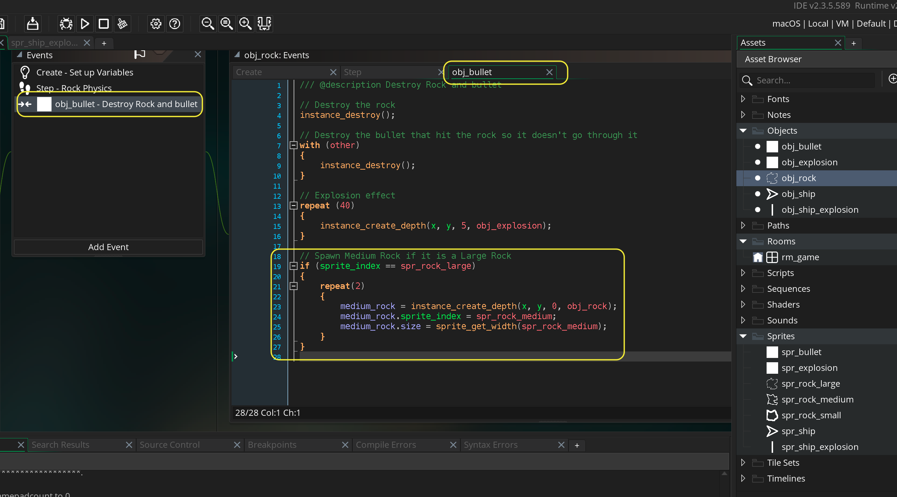
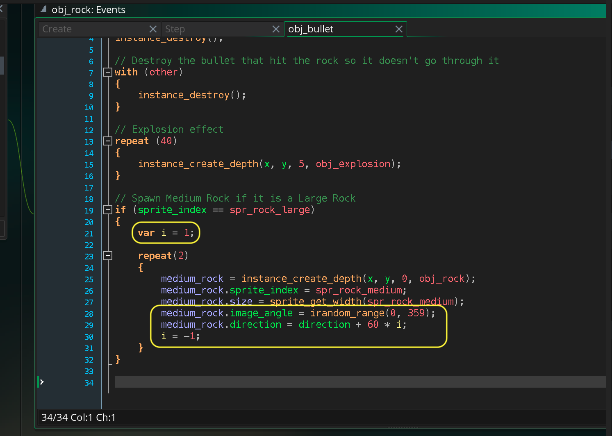
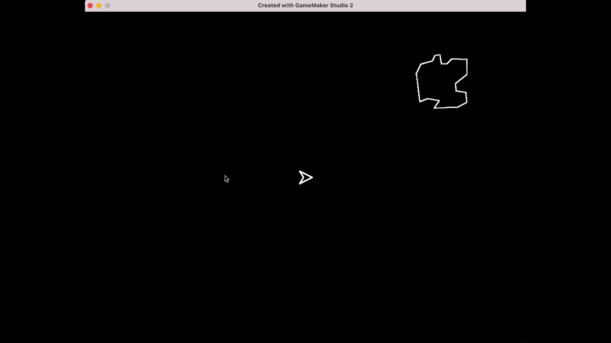
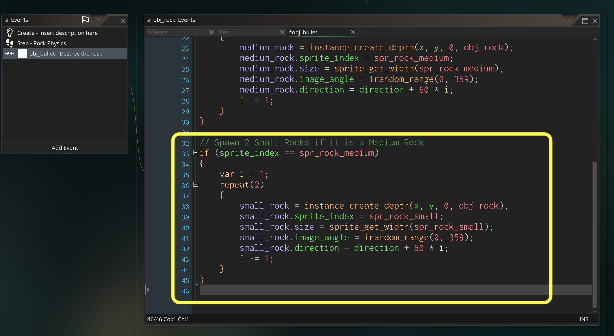
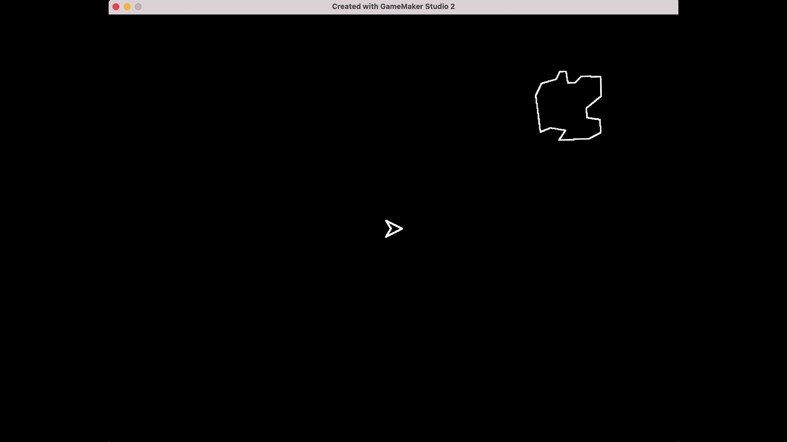

### Spawn Next Size Rock

[previous](../asteroids-ii/README.md#user-content-asteroids-ii) • [home](../README.md#user-content-gms2-ue4-space-rocks) • [next](../game-loop/README.md#user-content-main-game-loop)

Now in the original game when a rock is destroyed two rocks spawn of a smaller size.  So the large rock spawns two mediums.  The medium spawns two small rocks.  This allows one large rocks to have 6 more rocks spawn from it.

 

---

##### `Step 1.`\|`SPCRK`|:small_blue_diamond:

Open up **obj_rock** and go to **Collisions | obj_bullet** and now lets check to see if the rock is large.  We can use **[sprite_index(spr)](https://manual.yoyogames.com/GameMaker_Language/GML_Reference/Asset_Management/Sprites/Sprite_Instance_Variables/sprite_index.htm)** top check for the size of the rock by looking at the sprite name.

> This variable returns the index of the current sprite for the instance, or -1 if the instance has no sprite associated with it. You can change it to give the instance a different sprite by giving it the name of a sprite from the resource tree or by using a variable that has an externally loaded sprite indexed in it. - GameMaker Manual

Then we repeat spawining a rock twice.  Now we need to change the default `sprite_index` as it is set to **spr_rock_large**.  We also need to change the size for deciding where to spawn and where to `move_wrap` with the `size` variable.  We can dot instance into another object instance's variable because `instance_create_depth()` returns the id of this instance of the newly created rock.

##### `Step 2.`\|`FHIU`|:small_blue_diamond: :small_blue_diamond: 

Now *press* the <kbd>Play</kbd> button in the top menu bar to launch the game. Now the problem is that it creates two rocks on top of each other so it looks like one rock. This means that it looks like we have to shoot it twic to kill it.  But it is two objects right on top of each other.

##### `Step 3.`\|`SPCRK`|:small_blue_diamond: :small_blue_diamond: :small_blue_diamond:

So lets send the rocks off at different angles from the original path.  Also lets randomize the rotation of the rock so they are offset and look more natural.

Now since I want one to be +60 degrees and the other -60 degrees from the original path we have to create a variable to change the sign of the angle.  We use an `i` of `1` to multiply with the direction chain:

`medium_rock.direction = direction + 60 * i;`

So we need to dot instance into the newly spawned medium rock and set its direction to the current direction of the rock we are destroying by +- 60 degrees. By making `i = -1;` after the first loop means that it is + on the first loop and - on the second. 

##### `Step 4.`\|`SPCRK`|:small_blue_diamond: :small_blue_diamond: :small_blue_diamond: :small_blue_diamond:

Now *press* the <kbd>Play</kbd> button in the top menu bar to launch the game. Now destroy all three rocks.  It is working much better now!

##### `Step 5.`\|`SPCRK`| :small_orange_diamond:

Repeat this for the medium rock getting hit and turning into two small rocks.  We can cut and paste and make a few changes.  First it can be an `else if`.  A rock can't be both a large and medium.  So if it is large the condition will stop with the first check.  If we had it as an `if` it would still work, but it would always run regardless of whether it already performed the large rock operations above.

##### `Step 6.`\|`SPCRK`| :small_orange_diamond: :small_blue_diamond:

Now *press* the <kbd>Play</kbd> button in the top menu bar to launch the game. Now you can shoot all 7 rocks and we have the base mechanics of the ship and asteroids complete.

##### `Step 7.`\|`SPCRK`| :small_orange_diamond: :small_blue_diamond: :small_blue_diamond:

Select the **File | Save Project** then press **File | Quit** to make sure everything in the game is saved. If you are using **GitHub** open up **GitHub Desktop** and add a title and longer description (if necessary) and press the <kbd>Commit to main</kbd> button. Finish by pressing **Push origin** to update the server with the latest changes.

___

| [previous](../asteroids-ii/README.md#user-content-asteroids-ii)| [home](../README.md#user-content-gms2-ue4-space-rocks) | [next](../game-loop/README.md#user-content-main-game-loop)|
|---|---|---|
