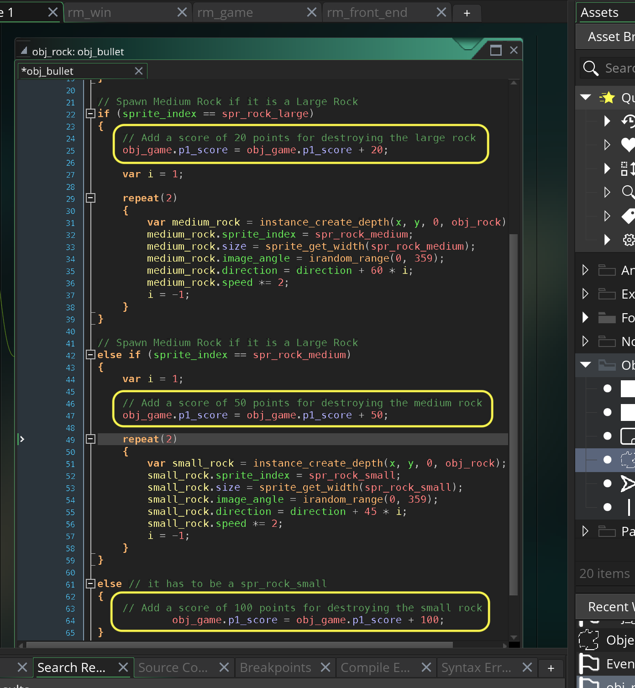
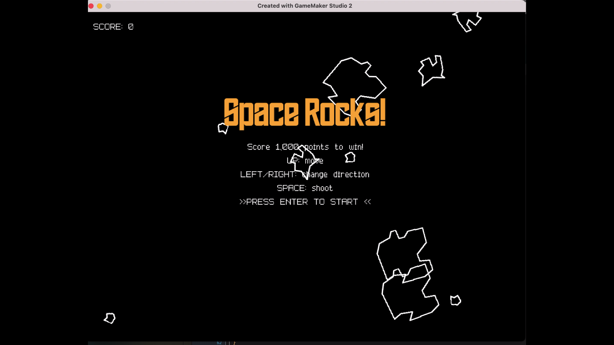

### Score

[previous](../game-loop/README.md#user-content-front-end) • [home](../README.md#user-content-gms2-ue4-space-rocks) • [next](../lives/README.md#user-content-lives-winning-and-losing)

Lets add a score display to the front end and game! The player will get 20 points for killing the large rock, 50 for medium and 100 for the small rock.  Since the rocks are progressively smaller and faster a larger score should be awarded.

 

---

##### `Step 1.`\|`SPCRK`|:small_blue_diamond:

Go to **obj_game** and press the <kbd>Add Event</kbd> and select a **Create** event. Create a new variable `p1_score` and set it to `0`.

##### `Step 2.`\|`FHIU`|:small_blue_diamond: :small_blue_diamond: 

Draw a score text in the front end.  It uses `draw_text` and remember to add two strings together you have to cast the real number to a string by using `string(p1_score)` as `p1_score` holds a real number variable.

Also, check to see if we are in `rm_game` and if we are set alignment to the left, color to white and font to low res.  Print the font again.

##### `Step 3.`\|`SPCRK`|:small_blue_diamond: :small_blue_diamond: :small_blue_diamond:

Now *press* the <kbd>Play</kbd> button in the top menu bar to launch the game. Now you should be able to see an empty score in each screen.

##### `Step 4.`\|`SPCRK`|:small_blue_diamond: :small_blue_diamond: :small_blue_diamond: :small_blue_diamond:

Now we can also dot instance into an ENTIRE object class.  So if we have `obj_game.sprite_index` we can access the **sprite_index** variable in **ALL** instances of this object in the room.  Since we only have one instance of hte game object it should be ok to access its variable for `p1_score`.

We need to do this because we have to open **obj_rock | Collision | obj_bullet** as this is the only place we have in the game when we know which rock is destroyed.  We just add 20, 50 and 100 points for each rock.  We have to add a final `else` and don't need to check to see if it is `sprite_index == spr_rock_small` as we have checked for large and medium so the only one left after that is small.

##### `Step 5.`\|`SPCRK`| :small_orange_diamond:

Now *press* the <kbd>Play</kbd> button in the top menu bar to launch the game. Now shoot all the rocks and you can get up to 520 points!

##### `Step 6.`\|`SPCRK`| :small_orange_diamond: :small_blue_diamond:

Select the **File | Save Project** then press **File | Quit** to make sure everything in the game is saved. If you are using **GitHub** open up **GitHub Desktop** and add a title and longer description (if necessary) and press the <kbd>Commit to main</kbd> button. Finish by pressing **Push origin** to update the server with the latest changes.

___

| [previous](../game-loop/README.md#user-content-front-end)| [home](../README.md#user-content-gms2-ue4-space-rocks) | [next](../lives/README.md#user-content-lives-winning-and-losing)|
|---|---|---|
