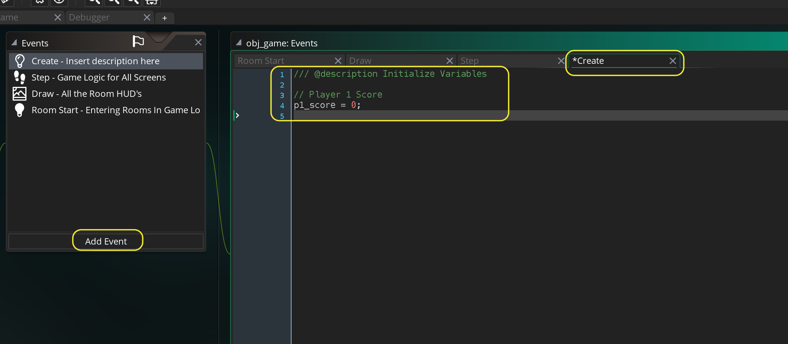
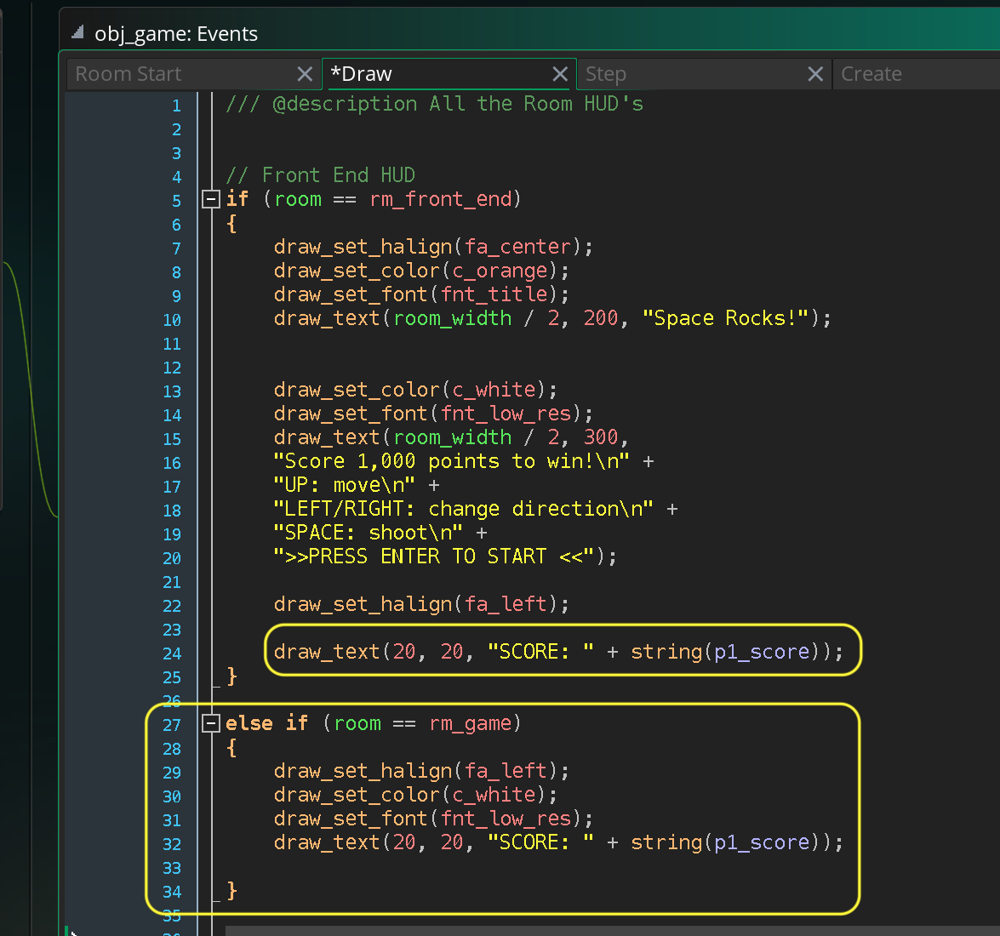
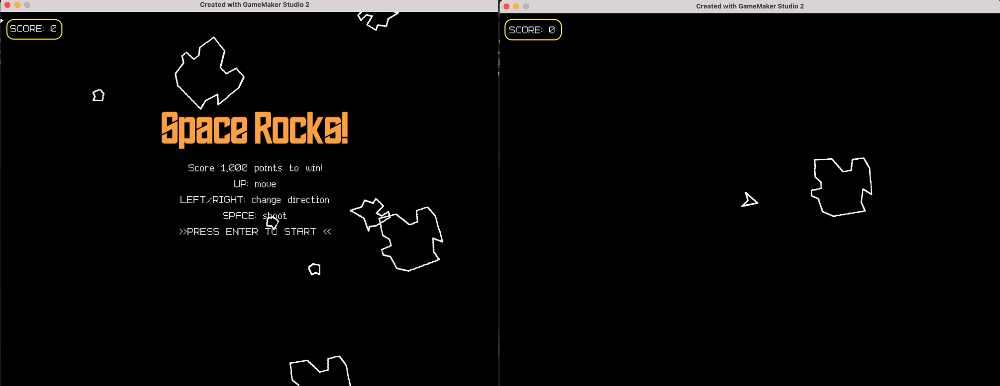

### Score

[previous](../game-loop/README.md#user-content-front-end) • [home](../README.md#user-content-gms2-ue4-space-rocks) • [next](../)

Lets add a score display to the front end and game! The player will get 20 points for killing the large rock, 50 for medium and 100 for the small rock.  Since the rocks are progressively smaller and faster a larger score should be awarded.

 

---

##### `Step 1.`\|`SPCRK`|:small_blue_diamond:

Go to **obj_game** and press the <kbd>Add Event</kbd> and select a **Create** event. Create a new variable `p1_score` and set it to `0`.

##### `Step 2.`\|`FHIU`|:small_blue_diamond: :small_blue_diamond: 

Draw a score text in the front end.  It uses `draw_text` and remember to add two strings together you have to cast the real number to a string by using `string(p1_score)` as `p1_score` holds a real number variable.

Also, check to see if we are in `rm_game` and if we are set alignment to the left, color to white and font to low res.  Print the font again.

##### `Step 3.`\|`SPCRK`|:small_blue_diamond: :small_blue_diamond: :small_blue_diamond:

Now *press* the <kbd>Play</kbd> button in the top menu bar to launch the game. Now you should be able to see an empty score in each screen.

##### `Step 4.`\|`SPCRK`|:small_blue_diamond: :small_blue_diamond: :small_blue_diamond: :small_blue_diamond:

##### `Step 5.`\|`SPCRK`| :small_orange_diamond:

##### `Step 6.`\|`SPCRK`| :small_orange_diamond: :small_blue_diamond:

##### `Step 7.`\|`SPCRK`| :small_orange_diamond: :small_blue_diamond: :small_blue_diamond:

##### `Step 8.`\|`SPCRK`| :small_orange_diamond: :small_blue_diamond: :small_blue_diamond: :small_blue_diamond:

##### `Step 9.`\|`SPCRK`| :small_orange_diamond: :small_blue_diamond: :small_blue_diamond: :small_blue_diamond: :small_blue_diamond:

##### `Step 10.`\|`SPCRK`| :large_blue_diamond:

##### `Step 11.`\|`SPCRK`| :large_blue_diamond: :small_blue_diamond: 

##### `Step 12.`\|`SPCRK`| :large_blue_diamond: :small_blue_diamond: :small_blue_diamond: 

##### `Step 13.`\|`SPCRK`| :large_blue_diamond: :small_blue_diamond: :small_blue_diamond:  :small_blue_diamond: 

##### `Step 14.`\|`SPCRK`| :large_blue_diamond: :small_blue_diamond: :small_blue_diamond: :small_blue_diamond:  :small_blue_diamond: 

##### `Step 15.`\|`SPCRK`| :large_blue_diamond: :small_orange_diamond: 

##### `Step 16.`\|`SPCRK`| :large_blue_diamond: :small_orange_diamond:   :small_blue_diamond: 

##### `Step 17.`\|`SPCRK`| :large_blue_diamond: :small_orange_diamond: :small_blue_diamond: :small_blue_diamond:

##### `Step 18.`\|`SPCRK`| :large_blue_diamond: :small_orange_diamond: :small_blue_diamond: :small_blue_diamond: :small_blue_diamond:

##### `Step 19.`\|`SPCRK`| :large_blue_diamond: :small_orange_diamond: :small_blue_diamond: :small_blue_diamond: :small_blue_diamond: :small_blue_diamond:

##### `Step 20.`\|`SPCRK`| :large_blue_diamond: :large_blue_diamond:

##### `Step 21.`\|`SPCRK`| :large_blue_diamond: :large_blue_diamond: :small_blue_diamond:

___

| [previous](../game-loop/README.md#user-content-front-end)| [home](../README.md#user-content-gms2-ue4-space-rocks) | [next](../)|
|---|---|---|
