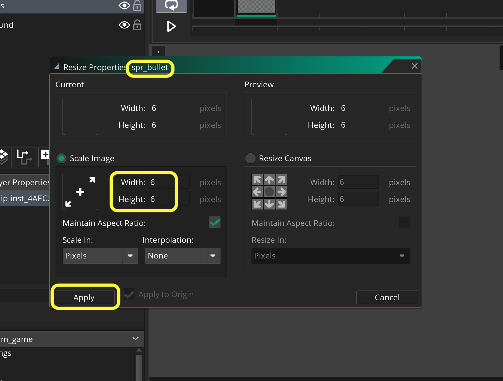
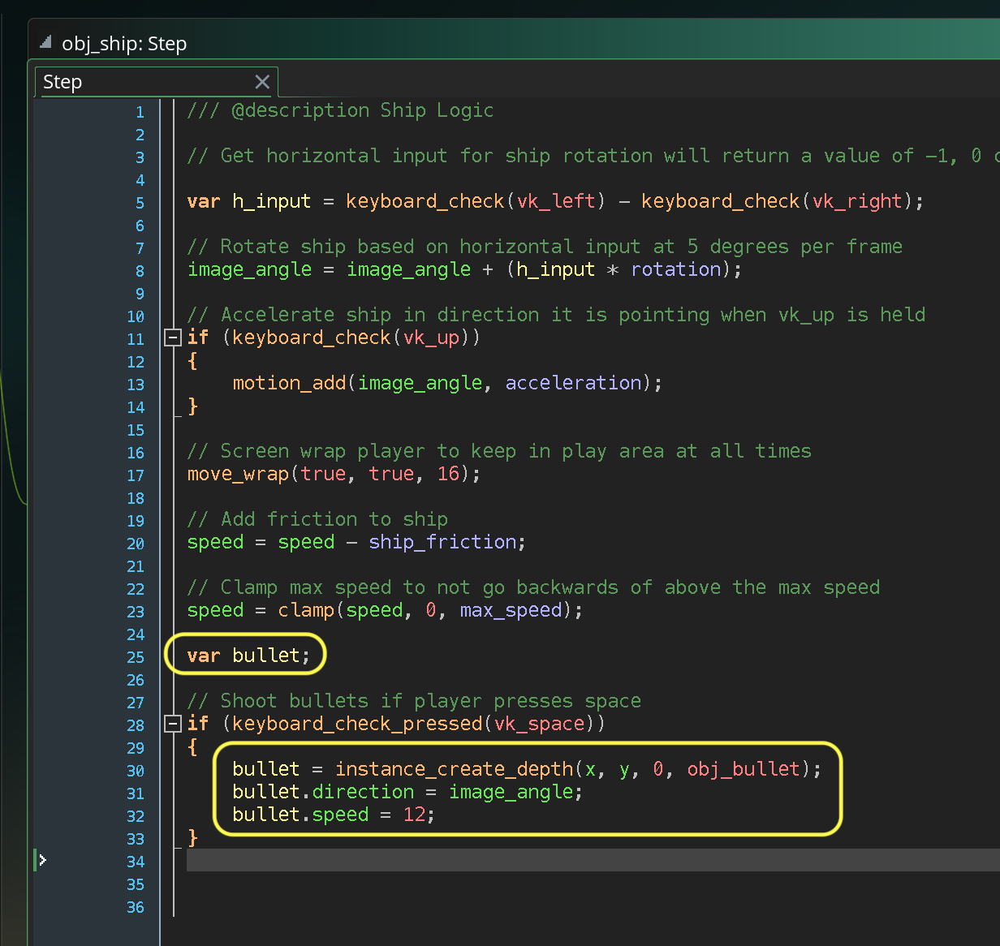
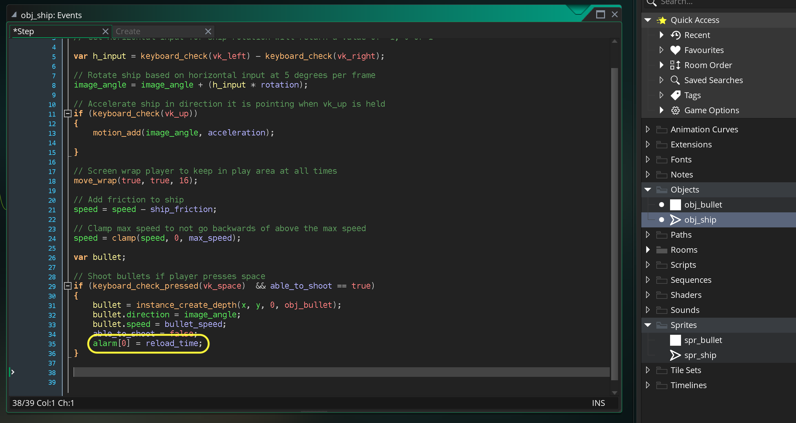

### Shooting

[previous](../spaceship-ii/README.md) • [home](../README.md#user-content-gms2-ue4-space-rocks) • [next](../asteroids-i/README.md#user-content-asteroids-i)

Now that we have a space ship flying around the level we want to add the ability for the ship to shoot bullets.  We will look at the issues that arise when dynamically creating game objects based on a user interaction.

 

---

##### `Step 1.`\|`SPCRK`|:small_blue_diamond:

As with every session we start by checkout out all files in **P4V** so that they are all writable (otherwise they will be read only and none of the changes will be saved).

Open up **GameMaker** and load the **SpaceRocks** project. *Right click* on **Sprites** and select **New | Sprite** and name it `spr_bullet`. Change the size of the canvas to `6` by `6`.

##### `Step 2.`\|`FHIU`|:small_blue_diamond: :small_blue_diamond: 

Press the <kbd>Edit Image</kbd> button. Select a white color and the **Fill** tool. Fill in the sprite so it is solid white.

##### `Step 3.`\|`SPCRK`|:small_blue_diamond: :small_blue_diamond: :small_blue_diamond:

*Right click* on **Objects** and select **New | Object** and name it `obj_bullet`. Set the **Sprite** to `spr_bullet`.

##### `Step 4.`\|`SPCRK`|:small_blue_diamond: :small_blue_diamond: :small_blue_diamond: :small_blue_diamond:

Open up **ObjShip | Step** event. Now we will be using **[instance_create_depth(x, y, depth, obj)](https://manual.yoyogames.com/GameMaker_Language/GML_Reference/Asset_Management/Instances/instance_create_depth.htm)** to spawn a bullet. 

> With this function you can create a new instance of the specified object at any given point within the room and at the depth specified. The depth can be any value, where the lower the depth the "nearer" to the camera things will be drawn and the higher the depth the further away, so an instance at depth -200 will be drawn over an instance at depth +300 (for example). - GameMake manual

So we will first check to see if you have pressed the space key (`if (keyboard_check(vk_space))`) then create an instance at the **x** and **y** of the ship (spawn the bullet in the middle of the ship), then set the **depth** to `0` and the **object** to `obj_bullet`.

##### `Step 5.`\|`SPCRK`| :small_orange_diamond:

Now *press* the <kbd>Play</kbd> button in the top menu bar to launch the game. *Press* the <kbd>Space Bar</kbd> and fly around.  There are two large problems, first the bullets don't animate and they fire too many of them per second.  Lets fix the latter problem.

##### `Step 6.`\|`SPCRK`| :small_orange_diamond: :small_blue_diamond:

Lets look at **[keyboard_check_pressed(key)](https://manual.yoyogames.com/GameMaker_Language/GML_Reference/Game_Input/Keyboard_Input/keyboard_check_pressed.htm)**

> With this function you can check to see if a key has been pressed or not. Unlike the keyboard_check() function, this function will only run once for every time the key is pressed down, so for it to trigger again, the key must be first released and then pressed again. The function will take a keycode value as returned by the function ord() (only capital letters from A-Z or numbers from 0-9), or any of the vk_* constants listed on the main Keyboard Input page. - GameMaker Manual

Right now the bullet is being created every frame.  By changing to `keyboard_check_pressed(key)` the bullet will only launch once per every button press.  So you can only launch bullets as quickly as you can press the key.

If you cannot fire a bullet while turning left or right try reassigning the button to the S key for shooting.  You would do this with `keyboard_check_pressed(ord("S")))`.

##### `Step 7.`\|`SPCRK`| :small_orange_diamond: :small_blue_diamond: :small_blue_diamond:

Now *press* the <kbd>Play</kbd> button in the top menu bar to launch the game. Now when you press the space bar each time there is only a single bullet.

##### `Step 8.`\|`SPCRK`| :small_orange_diamond: :small_blue_diamond: :small_blue_diamond: :small_blue_diamond:

Now `instance_create_depth()` returns a **Real (instance ID value)**, which gives us access to the variables *inside* the instance we create.  So we can dot index into them. So we create a `var bullet` variable that will hold a reference to an instance of the single bullet you created in the room.

##### `Step 9.`\|`SPCRK`| :small_orange_diamond: :small_blue_diamond: :small_blue_diamond: :small_blue_diamond: :small_blue_diamond:

So now we can dot instance into the **direction** and **speed** of the bullet you just created.  You can set the **direction** to the `image_angle` of the ship (we are in **obj_ship**) and the speed to `12`.

##### `Step 10.`\|`SPCRK`| :large_blue_diamond:

Now *press* the <kbd>Play</kbd> button in the top menu bar to launch the game. Now press the <kbd>Space Bar</kbd> and you will notice that the bullets now move forward from the ship's facing direction at a fast speed.

##### `Step 11.`\|`SPCRK`| :large_blue_diamond: :small_blue_diamond: 

Now there is a problem.  *Run* the game in debug mode by pressing the **Bug** icon.  This runs the game in debug mode.  Move the game off to the side.  Press the **Enable real time debugging** icon that looks like a lightning bolt. This turns on real time debugging. Then press the **Instance** tab at the bottom. Fire some bullets and see that the bullet objects are spawned.  Notice that they never disappear!  This means that eventually you will run out of memory and the game will crash.  So we need to make sure that when they leave the room and do not have any more function to us that we delete them for ever.

##### `Step 12.`\|`SPCRK`| :large_blue_diamond: :small_blue_diamond: :small_blue_diamond: 

Open up **obj_bullet** and press the <kbd>Add Event</kbd> button and select **Other | Outside Room**.  This will only run when an object leaves the room.  We will add a **[instance_destroy()](https://manual.yoyogames.com/GameMaker_Language/GML_Reference/Asset_Management/Instances/instance_destroy.htm)** to destroy the bullet object.

> You call this function whenever you wish to "destroy" an instance, normally triggering a Destroy Event and also a Clean Up Event. Calling the function with no arguments will simply destroy the instance that is currently in scope and running the code. - GameMaker Manual

##### `Step 13.`\|`SPCRK`| :large_blue_diamond: :small_blue_diamond: :small_blue_diamond:  :small_blue_diamond: 

Now *press* the <kbd>Play</kbd> button in the top menu bar to launch the game. The only way to test it is to run it again in **Debug** mode.  Open up the **Instances** tab and make sure **Enable real time debugging** is on.  Now when the bullets leave the room they disappear and are no longer taking up memory.

##### `Step 14.`\|`SPCRK`| :large_blue_diamond: :small_blue_diamond: :small_blue_diamond: :small_blue_diamond:  :small_blue_diamond: 

Open up **obj_ship** and lets add three new variables.  Add a variable called `bullet_speed`.  We will use this to replace the hard coded value we put in the game already.  Create another variable called `reload_time` and set it to `5` frames.  We will use this to pause the firing (allow bullet to reload) for 5 frames before allowing the player to fire again.  We will also create a boolean variable `able_to_shoot` and set it to `true`.  We will use this as a switch to turn on and off the ability to shoot.

##### `Step 15.`\|`SPCRK`| :large_blue_diamond: :small_orange_diamond: 

Change the `bullet.speed = 12;` to `bullet.speed = bullet_speed;` in **obj_ship | Step**. This replaces the hard-coded value with a variable that we can tune.  Lets also add a compund if statement so that not only does the player have ot press the space bar, but the && (and) also requires them to have `able_to_shoot` to be `true`.  We also will make `able_to_shoot` false when the bullet fires.  

##### `Step 16.`\|`SPCRK`| :large_blue_diamond: :small_orange_diamond:   :small_blue_diamond: 

Now *press* the <kbd>Play</kbd> button in the top menu bar to launch the game. Now the game fires a single bullet and `able_to_shoot` is false so it will not fire any more bullets.  This is what we want.  We will set it to `true` again after the `reload_time`.

##### `Step 17.`\|`SPCRK`| :large_blue_diamond: :small_orange_diamond: :small_blue_diamond: :small_blue_diamond:

We will be using an **[alarm](https://manual.yoyogames.com/GameMaker_Language/GML_Reference/Asset_Management/Instances/Instance_Variables/alarm.htm)**.

> This 1 dimension array is used to get the current value for any alarms that the instance may have, or it can be used to set those alarms. There are twelve alarms built into each instance of an object, and each one has its own event that will run when this variable reaches 0. - GameMake Manual 

We will set an alarm to go off in 5 frames (length of `reload_time`).

##### `Step 18.`\|`SPCRK`| :large_blue_diamond: :small_orange_diamond: :small_blue_diamond: :small_blue_diamond: :small_blue_diamond:

Now press the <kbd>Add Event</kbd> button and select **Alarm | Alarm0**.  This alarm will reset `able_to_shoot` back to `true`.

##### `Step 19.`\|`SPCRK`| :large_blue_diamond: :small_orange_diamond: :small_blue_diamond: :small_blue_diamond: :small_blue_diamond: :small_blue_diamond:

Now *press* the <kbd>Play</kbd> button in the top menu bar to launch the game. Now we should have the bullets working just the way we want.  Feel free to tune the numbers used to tweak the gameplay to your preference.  None of the values I gave are "correct" and it is up to personal preference.

##### `Step 20.`\|`SPCRK`| :large_blue_diamond: :large_blue_diamond:

Select the **File | Save Project** then press **File | Quit** to make sure everything in the game is saved. 

##### `Step 21.`\|`SPCRK`| :large_blue_diamond: :large_blue_diamond: :small_blue_diamond:

Select the top folder and press the **Add** button.  We want to add all the new files we created during this last session.  Add these files to the last change list you used at the begining of the session (in my case it was `Spaceship I portion of walkthrough`). Press the <kbd>OK</kbd> button.

##### `Step 22.`\|`SPCRK`| :large_blue_diamond: :large_blue_diamond: :small_blue_diamond: :small_blue_diamond:

Now you can submit the changelist by pressing both <kbd>Submit</kbd> buttons.

___

<!--  -->

| [previous](../spaceship-ii/README.md)| [home](../README.md#user-content-gms2-ue4-space-rocks) | [next](../asteroids-i/README.md#user-content-asteroids-i)|
|---|---|---|
