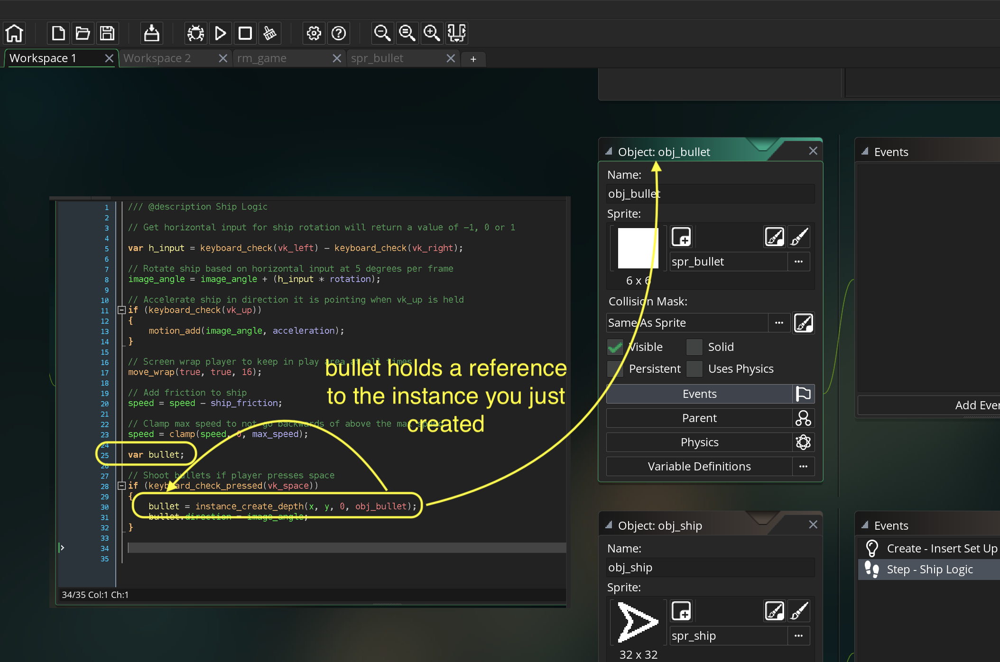

### Shooting

[previous](../) • [home](../README.md#user-content-gms2-ue4-space-rocks) • [next](../)

Now that we have a space ship flying around the level we want to add the ability for the ship to shoot bullets.  We will look at the issues that arise when dynamically creating game objects based on a user interaction.

 

---

##### `Step 1.`\|`SPCRK`|:small_blue_diamond:

*Right click* on **Sprites** and select **New | Sprite** and name it `spr_bullet`. Change the size of the canvas to `6` by `6`.

##### `Step 2.`\|`FHIU`|:small_blue_diamond: :small_blue_diamond: 

Select a white color and the **Fill** tool. Fill in the sprite so it is solid white.

##### `Step 3.`\|`SPCRK`|:small_blue_diamond: :small_blue_diamond: :small_blue_diamond:

*Right click* on **Objects** and select **New | Object** and name it `obj_bullet`. Set the **Sprite** to `spr_bullet`.

##### `Step 4.`\|`SPCRK`|:small_blue_diamond: :small_blue_diamond: :small_blue_diamond: :small_blue_diamond:

Now we will be using **[instance_create_depth(x, y, depth, obj)](https://manual.yoyogames.com/GameMaker_Language/GML_Reference/Asset_Management/Instances/instance_create_depth.htm)** to spawn a bullet. 

> With this function you can create a new instance of the specified object at any given point within the room and at the depth specified. The depth can be any value, where the lower the depth the "nearer" to the camera things will be drawn and the higher the depth the further away, so an instance at depth -200 will be drawn over an instance at depth +300 (for example). - GameMake manual

So we will first check to see if you have pressed the space key (`if (keyboard_check(vk_space))`) then create an instance at the **x** and **y** of the ship (spawn the bullet in the middle of the ship), then set the **depth** to `0` and the **object** to `obj_bullet`.

##### `Step 5.`\|`SPCRK`| :small_orange_diamond:

Now *press* the <kbd>Play</kbd> button in the top menu bar to launch the game. *Press* the <kbd>Space Bar</kbd> and fly around.  There are two large problems, first the bullets don't animate and they fire too many of them per second.  Lets fix the latter problem.

##### `Step 6.`\|`SPCRK`| :small_orange_diamond: :small_blue_diamond:

Lets look at **[keyboard_check_pressed(key)](https://manual.yoyogames.com/GameMaker_Language/GML_Reference/Game_Input/Keyboard_Input/keyboard_check_pressed.htm)**

> With this function you can check to see if a key has been pressed or not. Unlike the keyboard_check() function, this function will only run once for every time the key is pressed down, so for it to trigger again, the key must be first released and then pressed again. The function will take a keycode value as returned by the function ord() (only capital letters from A-Z or numbers from 0-9), or any of the vk_* constants listed on the main Keyboard Input page. - GameMaker Manual

Right now the bullet is being created every frame.  By changing to `keyboard_check_pressed(key)` the bullet will only launch once per every button press.  So you can only launch bullets as quickly as you can press the key.

##### `Step 7.`\|`SPCRK`| :small_orange_diamond: :small_blue_diamond: :small_blue_diamond:

Now *press* the <kbd>Play</kbd> button in the top menu bar to launch the game. Now when you press the space bar each time there is only a single bullet.

##### `Step 8.`\|`SPCRK`| :small_orange_diamond: :small_blue_diamond: :small_blue_diamond: :small_blue_diamond:

Now `instance_create_depth()` returns a **Real (instance ID value)**, which gives us access to the variables *inside* the instance we create.  So we can dot index into them. So we create a `var bullet` variable that will hold a reference to an instance of the single bullet you created in the room.

##### `Step 9.`\|`SPCRK`| :small_orange_diamond: :small_blue_diamond: :small_blue_diamond: :small_blue_diamond: :small_blue_diamond:

##### `Step 10.`\|`SPCRK`| :large_blue_diamond:

##### `Step 11.`\|`SPCRK`| :large_blue_diamond: :small_blue_diamond: 

##### `Step 12.`\|`SPCRK`| :large_blue_diamond: :small_blue_diamond: :small_blue_diamond: 

##### `Step 13.`\|`SPCRK`| :large_blue_diamond: :small_blue_diamond: :small_blue_diamond:  :small_blue_diamond: 

##### `Step 14.`\|`SPCRK`| :large_blue_diamond: :small_blue_diamond: :small_blue_diamond: :small_blue_diamond:  :small_blue_diamond: 

##### `Step 15.`\|`SPCRK`| :large_blue_diamond: :small_orange_diamond: 

##### `Step 16.`\|`SPCRK`| :large_blue_diamond: :small_orange_diamond:   :small_blue_diamond: 

##### `Step 17.`\|`SPCRK`| :large_blue_diamond: :small_orange_diamond: :small_blue_diamond: :small_blue_diamond:

##### `Step 18.`\|`SPCRK`| :large_blue_diamond: :small_orange_diamond: :small_blue_diamond: :small_blue_diamond: :small_blue_diamond:

##### `Step 19.`\|`SPCRK`| :large_blue_diamond: :small_orange_diamond: :small_blue_diamond: :small_blue_diamond: :small_blue_diamond: :small_blue_diamond:

##### `Step 20.`\|`SPCRK`| :large_blue_diamond: :large_blue_diamond:

##### `Step 21.`\|`SPCRK`| :large_blue_diamond: :large_blue_diamond: :small_blue_diamond:

___

| [previous](../)| [home](../README.md#user-content-gms2-ue4-space-rocks) | [next](../)|
|---|---|---|
