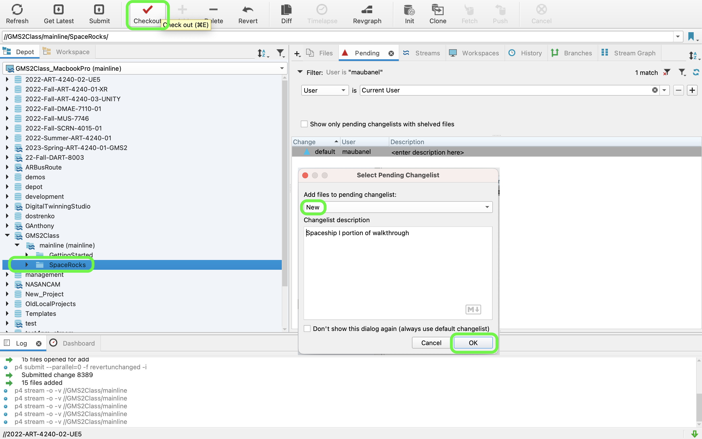
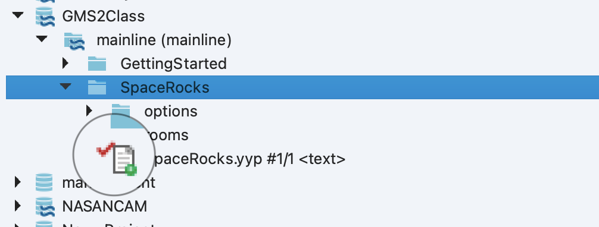

### The Spaceship I

[previous](../setting-up/README.md#user-content-setting-up) • [home](../README.md#user-content-gms2-ue4-space-rocks) • [next](../spaceship-ii/README.md#user-content-the-spaceship-ii)

Lets start by creating the spaceship artwork and getting the physics locked down so that we can perfect the feeling of the the game.

 

---

##### `Step 1.`\|`SPCRK`|:small_blue_diamond:

Now before we can work in **GameMaker** again, we need to make sure the files are writable.  Perforce locks all files as read only so essentially you will not be able to save any work.  It is **VERY IMPORTANT** that the first thing we do is check out all the files to make them **ALL** writable.  Open up **P4V** and select the **SpaceRocks** folder.  Press the <kbd>Check Out</kbd> button. Select a **New** changelist and describe the work you are going to do `Spaceship 1 portion of walkthrough`. Press the <OK> button.

Now all the files in the project will have a red check mark indicating that they are now writable and checked out.

##### `Step 2.`\|`FHIU`|:small_blue_diamond: :small_blue_diamond: 

Open up the project in **GameMaker** and select the **Rooms** folder. Rename **Room1** to `rm_game`.  Change the **Properties | Height** to `768` and the **Properties | Width** to `1024`.

##### `Step 3.`\|`SPCRK`|:small_blue_diamond: :small_blue_diamond: :small_blue_diamond:

*Right click* on **Sprites** and select **Create | Sprite** and name it `spr_ship`.  *Press* the <kbd>Resize</kbd> button (four arrows) to change the sprite. *Click* on **Resize Canvas** and change the **Width** and **Height** to `32` by `32`. Press the <kbd>Apply</kbd> button.

##### `Step 4.`\|`SPCRK`|:small_blue_diamond: :small_blue_diamond: :small_blue_diamond: :small_blue_diamond:

Now since we will be rotating the ship we want to change the **Origin** to `Middle Center`. Press the <kbd>Edit Image</kbd> button.

##### `Step 5.`\|`SPCRK`| :small_orange_diamond:

Select the white color and the second size square brush.  Press the <kbd>Polygon tool</kbd> button on the top left corner for just the outline.  Draw a triangle with a tail (so you know the ship is pointing right). Press the <kbd>Equal</kbd> button to see the sprite in its game size.

##### `Step 6.`\|`SPCRK`| :small_orange_diamond: :small_blue_diamond:

*Right click* on **Objects** and select **Create | Object** and name it `obj_ship`.  Assign sprite `spr_ship` by pressing **Sprite** and selecting the sprite.

##### `Step 7.`\|`SPCRK`| :small_orange_diamond: :small_blue_diamond: :small_blue_diamond:

Press the <kbd>Add Event</kbd> button and select the **Create** event.  Center the sprite on the screen.  Remember a **Create** event just runs once when the object is originally put into a level.  So this ensures that everytime a ship is created (maybe after it is destroyed by an asteroid) that it starts in the very middle of the level. Since our origin is center we can just divide the **[room_height](https://manual.yoyogames.com/GameMaker_Language/GML_Reference/Asset_Management/Rooms/room_height.htm)** and **[room_width](https://manual.yoyogames.com/GameMaker_Language/GML_Reference/Asset_Management/Rooms/room_width.htm)** by 2.

##### `Step 8.`\|`SPCRK`| :small_orange_diamond: :small_blue_diamond: :small_blue_diamond: :small_blue_diamond:

Open up **rm_game** and drag **obj_ship** to the middle of the room.  Don't worry about being too accurate as the **Create Event** will center the ship perfectly when you run the game.

##### `Step 9.`\|`SPCRK`| :small_orange_diamond: :small_blue_diamond: :small_blue_diamond: :small_blue_diamond: :small_blue_diamond:

Now *press* the <kbd>Play</kbd> button in the top menu bar to launch the game. You will see your spaceship facing right in the middle of the room with no physics.

##### `Step 10.`\|`SPCRK`| :large_blue_diamond:

To rotate we will be using the polar coordinate system to rotate the space ship.  **[image_angle](https://manual.yoyogames.com/GameMaker_Language/GML_Reference/Asset_Management/Sprites/Sprite_Instance_Variables/image_angle.htm)** is used to rotate the sprite to an angle between 0 and 359 degrees.  Right is 0 degrees, up is 90, left is 180 and down is 270.  So to move counter-clockwise we are adding degrees and to rotate clockwise we are subtracking degrees. The diagram below shows the spaceship's **image_angle** set to `90` degrees.

##### `Step 11.`\|`SPCRK`| :large_blue_diamond: :small_blue_diamond: 

We are using **[keyboard_check(key)](https://manual.yoyogames.com/GameMaker_Language/GML_Reference/Game_Input/Keyboard_Input/keyboard_check.htm)** that will return `1` when a key is being held and `0` when it is not. 

We need to *subtract* degrees for moving *clockwise* (the right arrow key) and *add* degrees for moving *counter-clockwise*.  So we will be subtracting vk_right from vk_left.  This way when we are pressing *right* we will get **(0-1) or -1** and when pressing *left* we will get **(1-0) or +1**.

##### `Step 12.`\|`SPCRK`| :large_blue_diamond: :small_blue_diamond: :small_blue_diamond: 

Lets take this into a script.  Open up **obj_ship** and press the <kbd>Add Event</kbd> button and select **Step | Step**.  A step event runs every frame and will be used to move our ship. Add the following steps:

1.  Subtract `vk_right` from `vk_left`.
2.  Change `image_angle` 5 degrees per frame.

In this code our when we set `image_angle = image_angle * 5`, this is adding either -5, 0 or 5 degrees  per frame. So if we are pressing left, `image_angle` starts at `0` (the default starting value of the ship facing right), then the second frame it moves to **0 + 5 or 5 degrees**. The next frame `image_angle` is now **5 degrees** and it will go to **5 + 5 or 10 degrees**. The next frame `image_angle` is now **10 degrees** and it will go to **10 + 5 or 15 degrees**. And so on and so on...

##### `Step 13.`\|`SPCRK`| :large_blue_diamond: :small_blue_diamond: :small_blue_diamond:  :small_blue_diamond: 

Now *press* the <kbd>Play</kbd> button in the top menu bar to launch the game. Press the <kbd>Left</kbd> and <kbd>Right</kbd> arrow and the ship should rotate.

##### `Step 14.`\|`SPCRK`| :large_blue_diamond: :small_blue_diamond: :small_blue_diamond: :small_blue_diamond:  :small_blue_diamond: 

Now we do not want to hard code values we would like to change and tweek.  We have hard coded 5 degrees as the speed of rotation.  Lets add a variable in **obj_ship | Create** event called `rotation`.

##### `Step 15.`\|`SPCRK`| :large_blue_diamond: :small_orange_diamond: 

Open up **obj_ship | Step** event and replace the hard coded value `5` with the variable `rotation`.

Now *press* the <kbd>Play</kbd> button in the top menu bar to launch the game. The game should be identical to how it was previously.

##### `Step 16.`\|`SPCRK`| :large_blue_diamond: :small_orange_diamond:   :small_blue_diamond: 

Open up **obj_ship | Create** event and create a new variable called `acceleration`.  This will be the amount we add to the speed of the ship in pixels per second.

##### `Step 17.`\|`SPCRK`| :large_blue_diamond: :small_orange_diamond: :small_blue_diamond: :small_blue_diamond:

We will be using **[motion_add(direction, speed)](https://manual.yoyogames.com/GameMaker_Language/GML_Reference/Movement_And_Collisions/Movement/motion_add.htm)**.

> This function (motion_add(direction, speed)) will modify the current direction and speed of the instance running the code, combining the values given with the current values. - GameMaker Manual

**[direction](https://manual.yoyogames.com/GameMaker_Language/GML_Reference/Asset_Management/Instances/Instance_Variables/direction.htm)** is like `image_angle` but instead of rotating a sprite it represents the angle that a game object is moving in.  So an object can move in a different direction that the direction it is pointing and needs a different variable.  So `image_angle` is for the sprite rotation and `direction` is for the *angle* the object is moving in.

`motion_add(dir, spd)` adds a new force when the condition is met (in this case pressing `vk_up`). This gives the sensation that the ship is moving in a frictionless environment.

So below we are adding an acceleration of the direction the ship is pointing in at a speed of `.2` (the value of the `acceleration` variable). It will only run when you press the **Up** arrow.

##### `Step 18.`\|`SPCRK`| :large_blue_diamond: :small_orange_diamond: :small_blue_diamond: :small_blue_diamond: :small_blue_diamond:

Now *press* the <kbd>Play</kbd> button in the top menu bar to launch the game. Notice that it feels like flying a space ship!  One major issue is that it can leave the level and no longer be seen, making it hard to fly back into the level.

##### `Step 19.`\|`SPCRK`| :large_blue_diamond: :small_orange_diamond: :small_blue_diamond: :small_blue_diamond: :small_blue_diamond: :small_blue_diamond:

There is a function called **[move_wrap(hor, vert, margin)](https://manual.yoyogames.com/GameMaker_Language/GML_Reference/Movement_And_Collisions/Movement/move_wrap.htm)** to wrap the player from one side to the other.  The **hor** and **ver** parameters are booleans and need a `true` or `false`.  We will set them both to `true` as we want to wrap on all four sides of the room.  For the margin, the ship will teleport when the `origin` leaves the level.  So for our ship to be completely out of the room we need to offset the **margin** by `16` which is the location of the origin on both the x and y axis.

##### `Step 20.`\|`SPCRK`| :large_blue_diamond: :large_blue_diamond:

Now *press* the <kbd>Play</kbd> button in the top menu bar to launch the game. Now the player will wrap but I keep accelerating in one direction the ship just goes faster and faster at infinitum.  We will need to clamp the speed.

##### `Step 21.`\|`SPCRK`| :large_blue_diamond: :large_blue_diamond: :small_blue_diamond:

Open up **spr_ship | Create** and add a variable called `max_speed` and set it to `8` pixels per frame.

##### `Step 22.`\|`SPCRK`| :large_blue_diamond: :large_blue_diamond: :small_blue_diamond: :small_blue_diamond:

Open up **spr_ship | Step** event and add a **[clamp(val, min, max)](https://manual.yoyogames.com/GameMaker_Language/GML_Reference/Maths_And_Numbers/Number_Functions/clamp.htm)**. 

> With this function you can maintain an input value between a specified range. - GameMaker Manual

The **val** is the variable we want to clamp.  The min and max are the range.  We don't want our ship to move backwards so our **min** will be `0` and **max** will be `max_speed` (8).

<!--  -->

| [previous](../setting-up/README.md#user-content-setting-up)| [home](../README.md#user-content-gms2-ue4-space-rocks) | [next](../spaceship-ii/README.md#user-content-the-spaceship-ii)|
|---|---|---|
