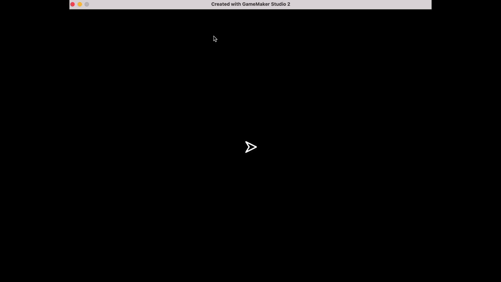

### The Spaceship II

[previous](../spaceship-i/README.md#user-content-the-spaceship-i) • [home](../README.md#user-content-gms2-ue4-space-rocks) • [next](../shooting/README.md#user-content-shooting)

Finishing up the movement of the space ship

 

---

##### `Step 1.`\|`SPCRK`|:small_blue_diamond:

Now *press* the <kbd>Play</kbd> button in the top menu bar to launch the game. Now you cannot endlessly accelerate and you have a maximum speed.  The only issue now is that if you let go you never stop.  Even in space there is a small amount of friction.

##### `Step 2.`\|`FHIU`|:small_blue_diamond: :small_blue_diamond: 

Open up **spr_ship | Create** event and add a `ship_friction` variable.  Make sure the amount is **less** than the acceleration or you will never get enough energy to overcome the frictional force.

##### `Step 3.`\|`SPCRK`|:small_blue_diamond: :small_blue_diamond: :small_blue_diamond:

Open up **obj_ship | Step** event and subtract the **ship_friction** from the **speed** variable.  Make sure it is placed before the clamp as we DO NOT want the **speed** variable to go below `0` which the clamp is taking care of.

##### `Step 4.`\|`SPCRK`|:small_blue_diamond: :small_blue_diamond: :small_blue_diamond: :small_blue_diamond:

Now *press* the <kbd>Play</kbd> button in the top menu bar to launch the game. Now you can tune your acceleration, turn speed and friction to your liking.  When you are done we are finished with the space ship physics.

##### `Step 5.`\|`SPCRK`| :small_orange_diamond:

Select the **File | Save Project** then press **GameMaker | Quit** to make sure everything in the game is saved. 

___

| [previous](../spaceship-i/README.md#user-content-the-spaceship-i)| [home](../README.md#user-content-gms2-ue4-space-rocks) | [next](../shooting/README.md#user-content-shooting)|
|---|---|---|
