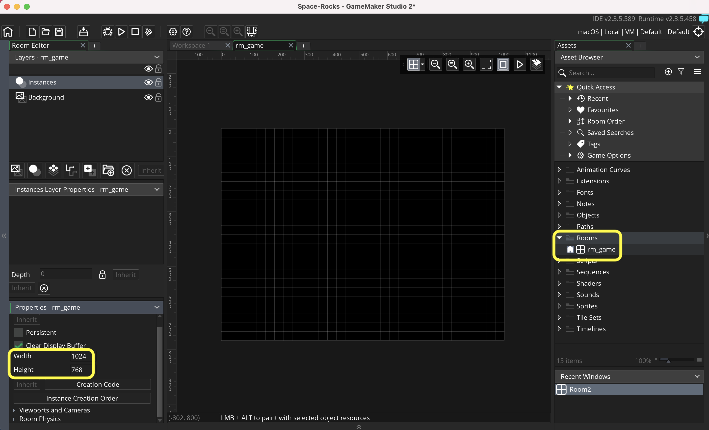
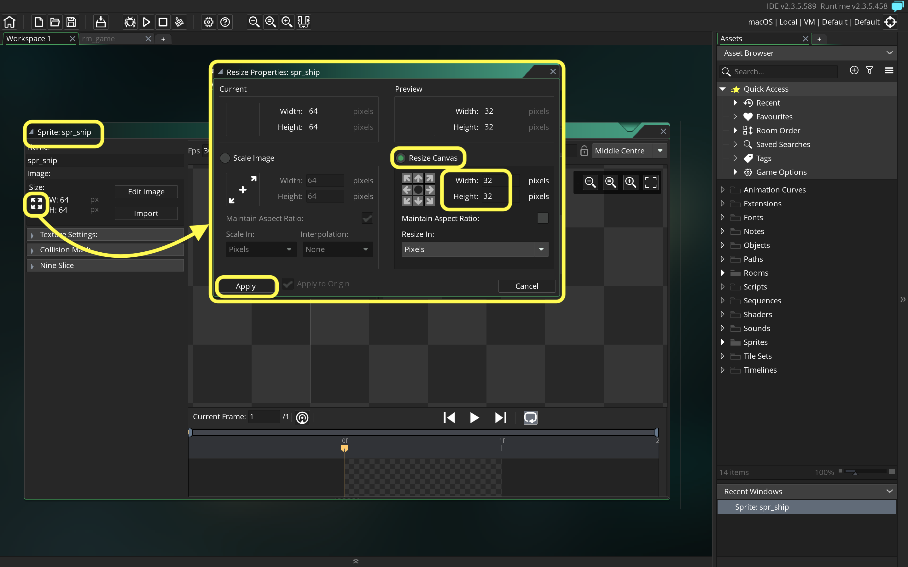
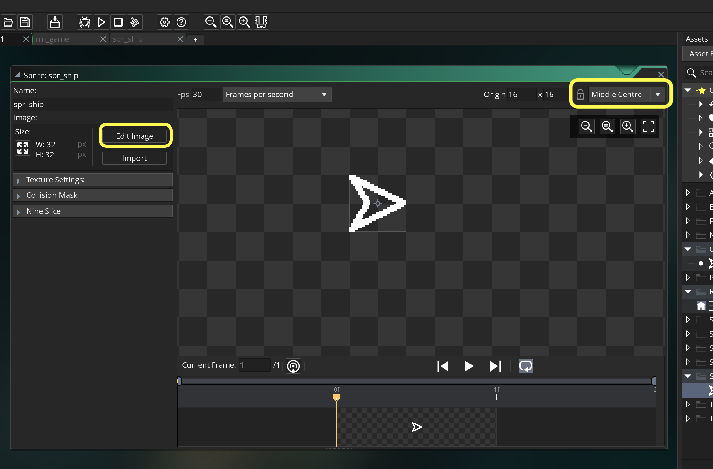
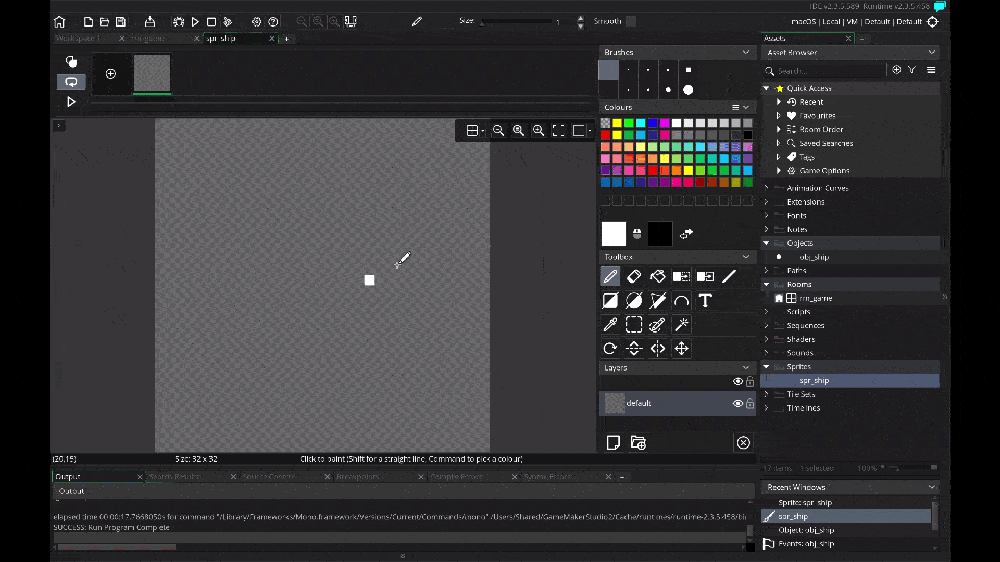
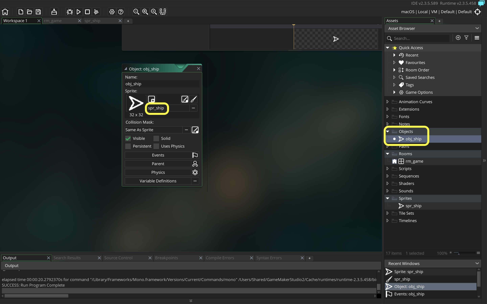
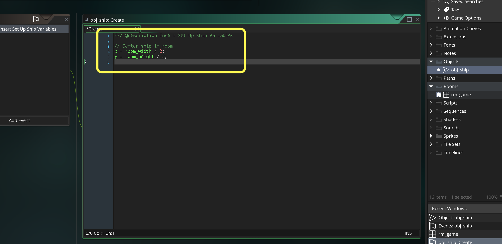
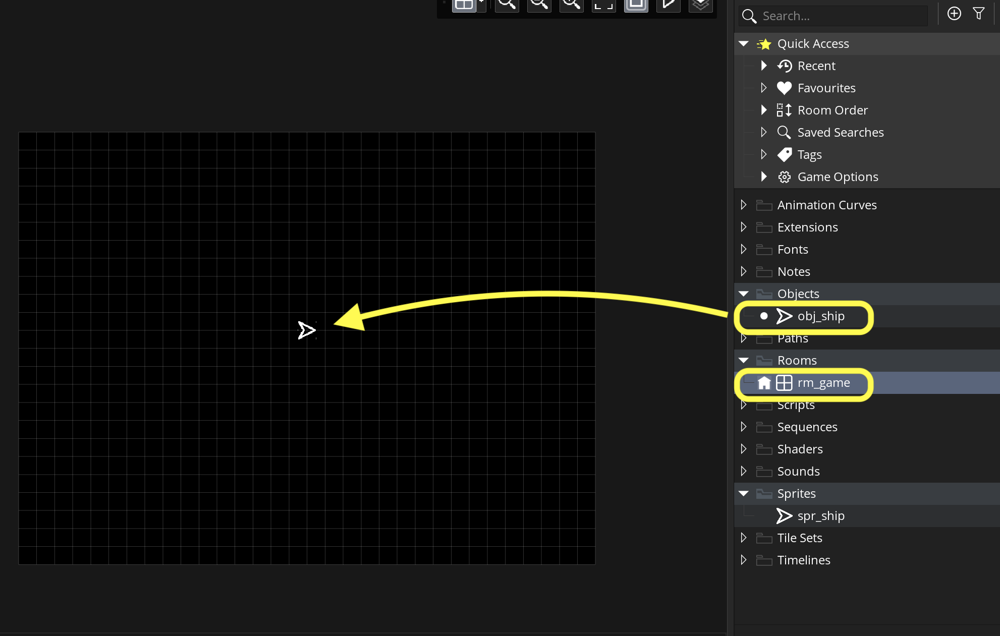

### The Spaceship

[previous](../setting-up/README.md#user-content-setting-up) • [home](../README.md#user-content-gms2-ue4-space-rocks) • [next](../)

Lets start by creating the spaceship artwork and getting the physics locked down so that we can perfect the feeling of the the game.

 

---

##### `Step 1.`\|`SPCRK`|:small_blue_diamond:

Open up the **Rooms** folder and rename **Room1** to `rm_game`.  Change the **Properties | Height** to `1024` and the **Properties | Width** to `728`.

##### `Step 2.`\|`FHIU`|:small_blue_diamond: :small_blue_diamond: 

*Right click* on **Sprites** and select **Create | Sprite** and name it `spr_ship`.  *Press* the <kbd>Resize</kbd> button (four arrows) to change the sprite. *Click* on **Resize Canvas** and change the **Width** and **Height** to `32` by `32`. Press the <kbd>Apply</kbd> button.

##### `Step 3.`\|`SPCRK`|:small_blue_diamond: :small_blue_diamond: :small_blue_diamond:

Now since we will be rotating the ship we want to change the **Origin** to `Middle Center`. Press the <kbd>Edit Image</kbd> button.

##### `Step 4.`\|`SPCRK`|:small_blue_diamond: :small_blue_diamond: :small_blue_diamond: :small_blue_diamond:

Select the white color and the second size square brush.  Press the <kbd>Polygon tool</kbd> button on the top left corner for just the outline.  Draw a triangle with a tail (so you know the ship is pointing right). Press the <kbd>Equal</kbd> button to see the sprite in its game size.

##### `Step 5.`\|`SPCRK`| :small_orange_diamond:

*Right click* on **Objects** and select **Create | Object** and name it `obj_ship`.  Assign sprite `spr_ship` by pressing **Sprite** and selecting the sprite.

##### `Step 6.`\|`SPCRK`| :small_orange_diamond: :small_blue_diamond:

Press the <kbd>Add Event</kbd> button and select the **Create** event.  Center the sprite on the screen.  Remember a **Create** event just runs once when the object is originally put into a level.  So this ensures that everytime a ship is created (maybe after it is destroyed by an asteroid) that it starts in the very middle of the level. Since our origin is center we can just divide the **[room_height](https://manual.yoyogames.com/GameMaker_Language/GML_Reference/Asset_Management/Rooms/room_height.htm)** and **[room_width](https://manual.yoyogames.com/GameMaker_Language/GML_Reference/Asset_Management/Rooms/room_width.htm)** by 2.

##### `Step 7.`\|`SPCRK`| :small_orange_diamond: :small_blue_diamond: :small_blue_diamond:

Open up **rm_game** and drag **obj_ship** to the middle of the room.  Don't worry about being too accurate as the **Create Event** will center the ship perfectly when you run the game.

##### `Step 8.`\|`SPCRK`| :small_orange_diamond: :small_blue_diamond: :small_blue_diamond: :small_blue_diamond:

##### `Step 9.`\|`SPCRK`| :small_orange_diamond: :small_blue_diamond: :small_blue_diamond: :small_blue_diamond: :small_blue_diamond:

##### `Step 10.`\|`SPCRK`| :large_blue_diamond:

##### `Step 11.`\|`SPCRK`| :large_blue_diamond: :small_blue_diamond: 

##### `Step 12.`\|`SPCRK`| :large_blue_diamond: :small_blue_diamond: :small_blue_diamond: 

##### `Step 13.`\|`SPCRK`| :large_blue_diamond: :small_blue_diamond: :small_blue_diamond:  :small_blue_diamond: 

##### `Step 14.`\|`SPCRK`| :large_blue_diamond: :small_blue_diamond: :small_blue_diamond: :small_blue_diamond:  :small_blue_diamond: 

##### `Step 15.`\|`SPCRK`| :large_blue_diamond: :small_orange_diamond: 

##### `Step 16.`\|`SPCRK`| :large_blue_diamond: :small_orange_diamond:   :small_blue_diamond: 

##### `Step 17.`\|`SPCRK`| :large_blue_diamond: :small_orange_diamond: :small_blue_diamond: :small_blue_diamond:

##### `Step 18.`\|`SPCRK`| :large_blue_diamond: :small_orange_diamond: :small_blue_diamond: :small_blue_diamond: :small_blue_diamond:

##### `Step 19.`\|`SPCRK`| :large_blue_diamond: :small_orange_diamond: :small_blue_diamond: :small_blue_diamond: :small_blue_diamond: :small_blue_diamond:

##### `Step 20.`\|`SPCRK`| :large_blue_diamond: :large_blue_diamond:

##### `Step 21.`\|`SPCRK`| :large_blue_diamond: :large_blue_diamond: :small_blue_diamond:

___

| [previous](../setting-up/README.md#user-content-setting-up)| [home](../README.md#user-content-gms2-ue4-space-rocks) | [next](../)|
|---|---|---|
