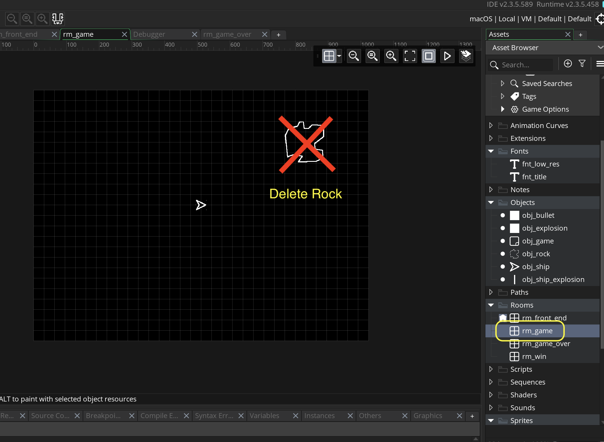
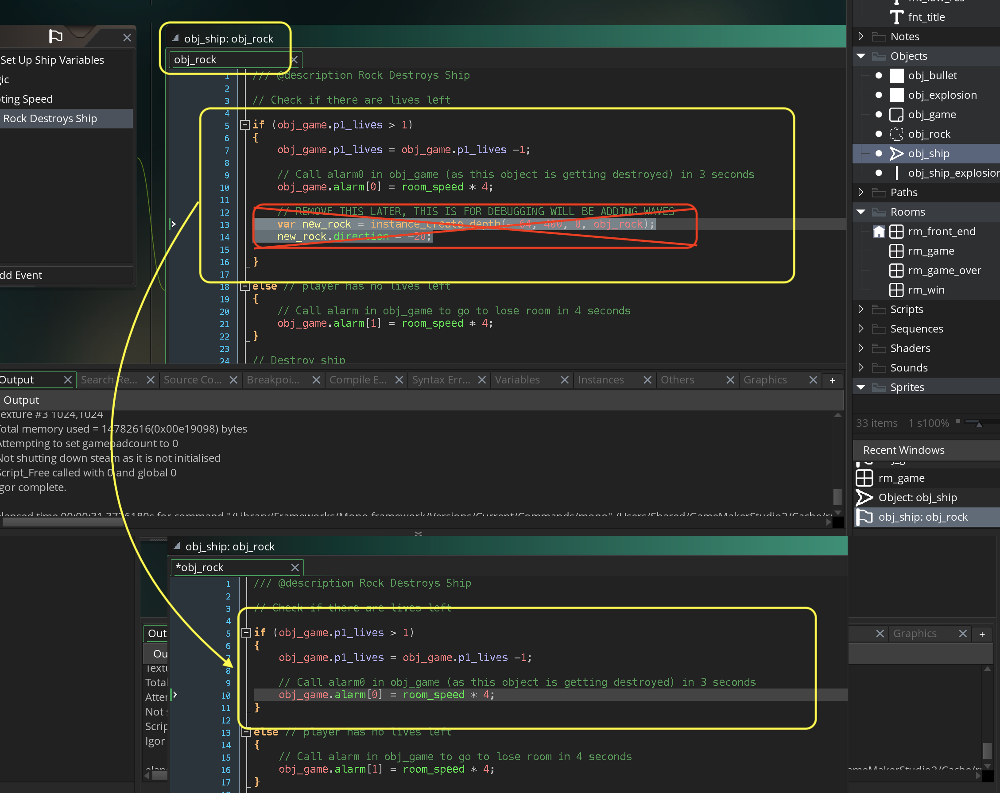
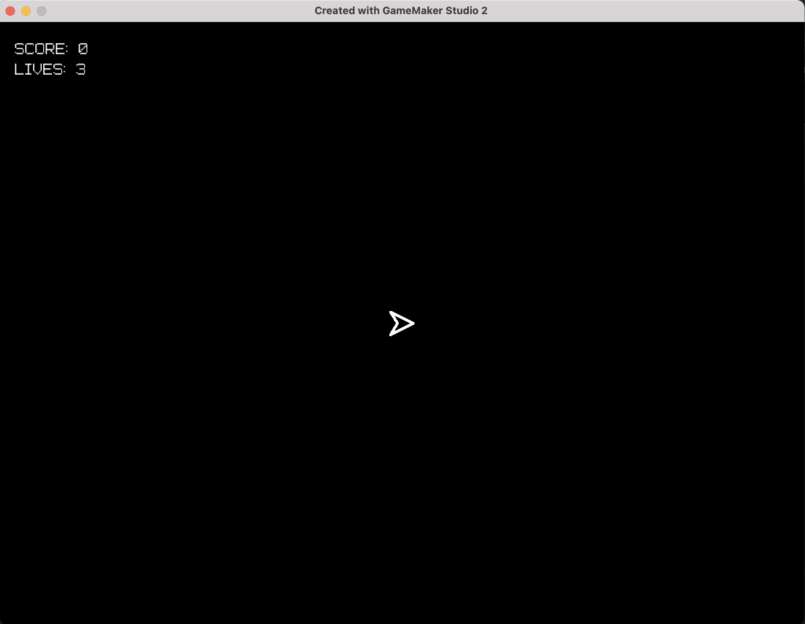
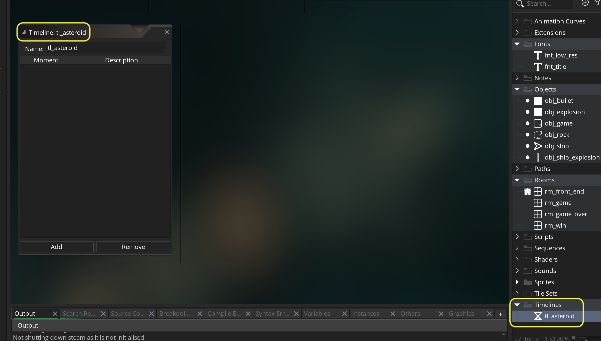
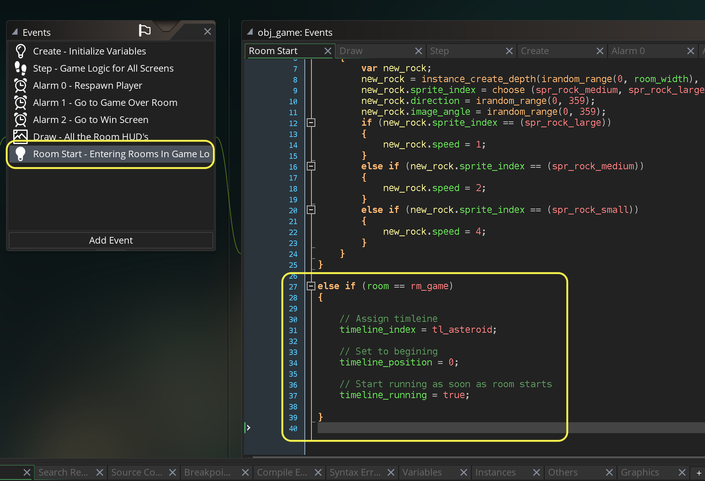

### Launch Waves

[previous](../lives/README.md#user-content-lives-winning-and-losing) • [home](../README.md#user-content-gms2-ue4-space-rocks) • [next](../)

Now we would like to launch a wave of rocks at the player.  We could use alarms to do this but are restricted to 12 alarms per object.  There is another **GameMaker** resource that is made for spawning objects like asteroids called **[timelines()](https://manual.yoyogames.com/GameMaker_Language/GML_Reference/Asset_Management/Timelines/Timelines.htm)**.  

> Timelines are a powerful mechanism for controlling events in your game, and are based on "moments", where a "moment" is simply a single game step. These timelines are generally created from the Asset Browser using the Timeline Editor in a similar way to an object, ie: you create a timeline, then in each moment that you require it to perform an action you add some code for it to perform. Once created, you can then stop, start, and manipulate timelines through code. You can even modify individual moments by defining a script function and adding it into the timeline dynamically from a controller object (for example), making this a very powerful and versatile tool when creating your games. - GameMaker Manual

Lets look at this.

 

---

##### `Step 1.`\|`SPCRK`|:small_blue_diamond:

We will use timelines to spawn the rocks so go to **rm_game** and delete the rock we have in the room.

##### `Step 2.`\|`FHIU`|:small_blue_diamond: :small_blue_diamond: 

Now we added rock spawning on player death to test lives.  We will now remove it as we will be adding waves.  Open up **obj_ship | Collision | obj_rock** and remove the rock spawning.

##### `Step 3.`\|`SPCRK`|:small_blue_diamond: :small_blue_diamond: :small_blue_diamond:

Now *press* the <kbd>Play</kbd> button in the top menu bar to launch the game. You will notice in game we have no more rocks.  Perfect, lets move forward.

##### `Step 4.`\|`SPCRK`|:small_blue_diamond: :small_blue_diamond: :small_blue_diamond: :small_blue_diamond:

*Right click* on **Timelines** and select **New | Timeline** and name it `tl_asteroid`.

##### `Step 5.`\|`SPCRK`| :small_orange_diamond:

Now each object has a timeline. So we will use our **obj_game** and use its *timeline*.  It is not an object that the player interacts with and is not destroyed so we know the timeline will keep playing.  

Now the **timeline** you just created is not linked to any boject yet.  Just like our sprite has `sprite_index` to set a **new sprite**, we also have a **[timeline_index](https://manual.yoyogames.com/GameMaker_Language/GML_Reference/Asset_Management/Timelines/timeline_index.htm)** varible to point to a specific timeline. It's default value is -1 which means that it is not set to any timeline.  We set it simply by
`timeline_index = tl_asteroid`.

We want to start from the begining of the timeline. There is a variable called **[timeline_position](https://manual.yoyogames.com/GameMaker_Language/GML_Reference/Asset_Management/Timelines/timeline_position.htm)**.  We will set it to the begining (just in case it is not there) with `timeline_position = 0`.

Finally we have got to tell the timeline to start running (it defaults to off or not running). There is a boolean variable called **[timeline_running](https://manual.yoyogames.com/GameMaker_Language/GML_Reference/Asset_Management/Timelines/timeline_running.htm)**.  We will set it to `true`.

So open **obj_game: Room Start** event and add to the very bottom the above for *only* the **rm_game**.

##### `Step 6.`\|`SPCRK`| :small_orange_diamond: :small_blue_diamond:

##### `Step 7.`\|`SPCRK`| :small_orange_diamond: :small_blue_diamond: :small_blue_diamond:

##### `Step 8.`\|`SPCRK`| :small_orange_diamond: :small_blue_diamond: :small_blue_diamond: :small_blue_diamond:

##### `Step 9.`\|`SPCRK`| :small_orange_diamond: :small_blue_diamond: :small_blue_diamond: :small_blue_diamond: :small_blue_diamond:

##### `Step 10.`\|`SPCRK`| :large_blue_diamond:

##### `Step 11.`\|`SPCRK`| :large_blue_diamond: :small_blue_diamond: 

##### `Step 12.`\|`SPCRK`| :large_blue_diamond: :small_blue_diamond: :small_blue_diamond: 

##### `Step 13.`\|`SPCRK`| :large_blue_diamond: :small_blue_diamond: :small_blue_diamond:  :small_blue_diamond: 

##### `Step 14.`\|`SPCRK`| :large_blue_diamond: :small_blue_diamond: :small_blue_diamond: :small_blue_diamond:  :small_blue_diamond: 

##### `Step 15.`\|`SPCRK`| :large_blue_diamond: :small_orange_diamond: 

##### `Step 16.`\|`SPCRK`| :large_blue_diamond: :small_orange_diamond:   :small_blue_diamond: 

##### `Step 17.`\|`SPCRK`| :large_blue_diamond: :small_orange_diamond: :small_blue_diamond: :small_blue_diamond:

##### `Step 18.`\|`SPCRK`| :large_blue_diamond: :small_orange_diamond: :small_blue_diamond: :small_blue_diamond: :small_blue_diamond:

##### `Step 19.`\|`SPCRK`| :large_blue_diamond: :small_orange_diamond: :small_blue_diamond: :small_blue_diamond: :small_blue_diamond: :small_blue_diamond:

##### `Step 20.`\|`SPCRK`| :large_blue_diamond: :large_blue_diamond:

##### `Step 21.`\|`SPCRK`| :large_blue_diamond: :large_blue_diamond: :small_blue_diamond:

___

| [previous](../lives/README.md#user-content-lives-winning-and-losing)| [home](../README.md#user-content-gms2-ue4-space-rocks) | [next](../)|
|---|---|---|
