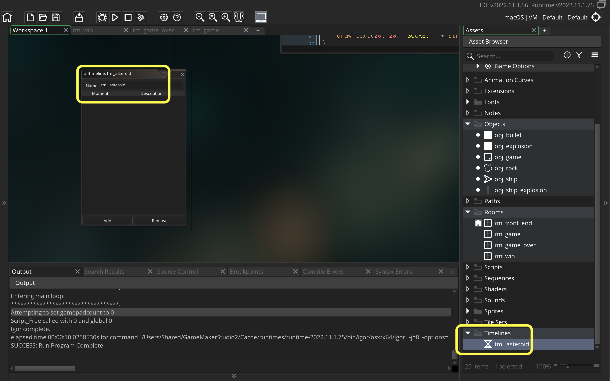
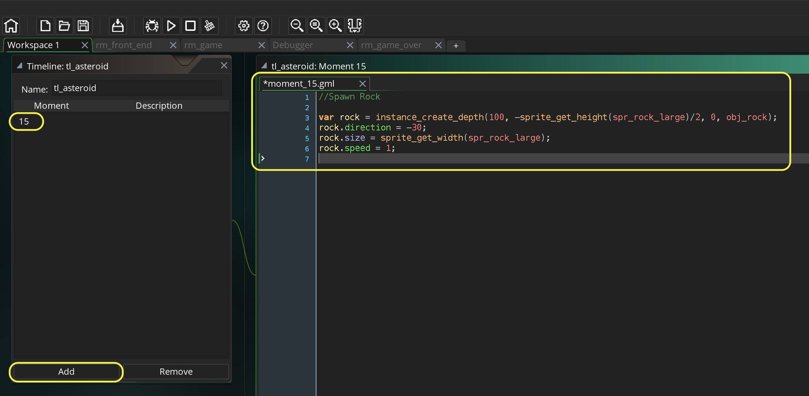
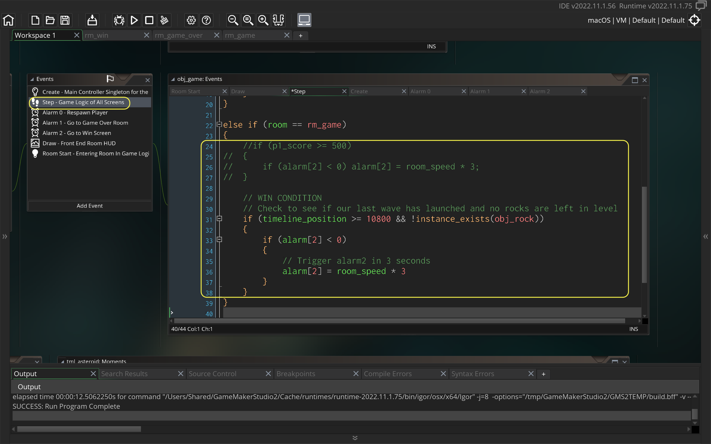
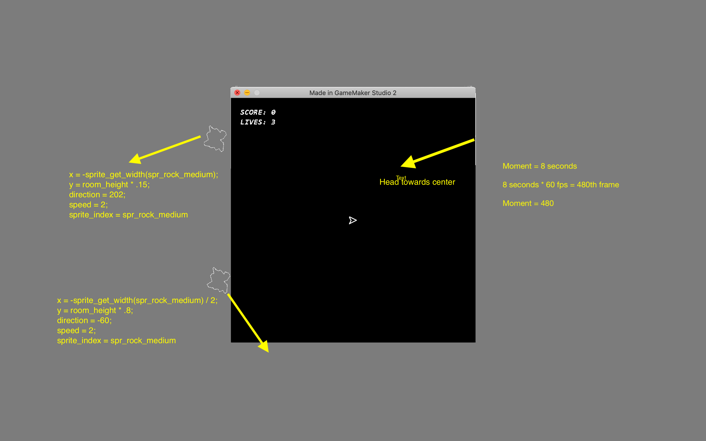
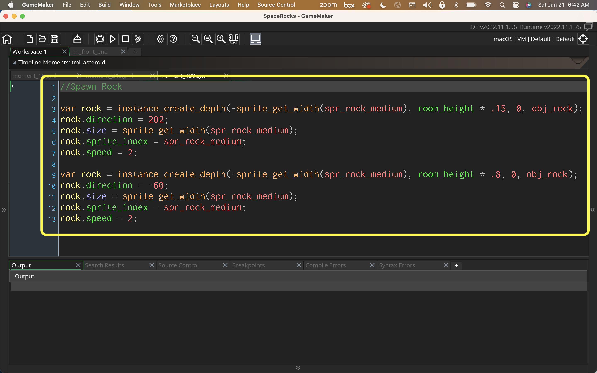
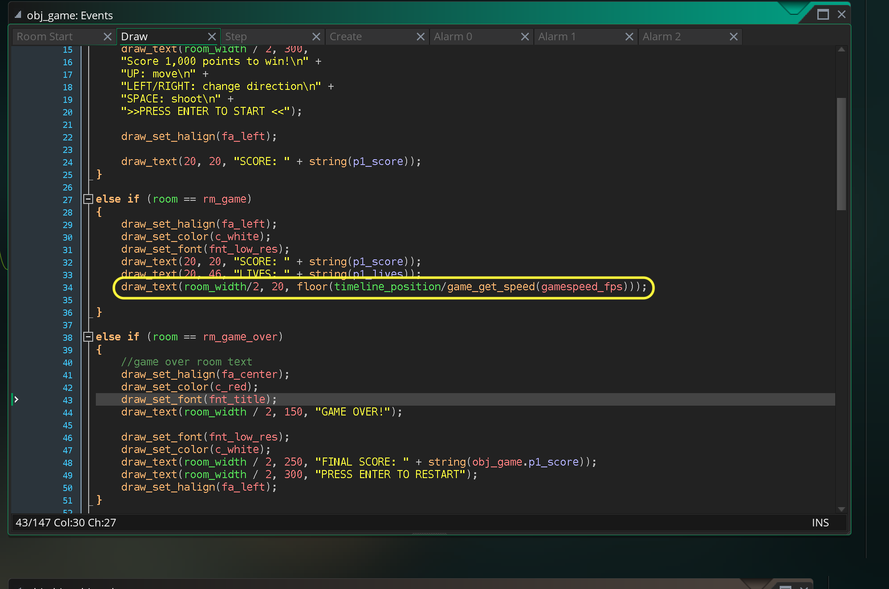

### Launch Waves

<sub>[previous](../lives/README.md#user-content-lives-winning-and-losing) • [home](../README.md#user-content-gms2-ue4-space-rocks) • [next](../audio/README.md#user-content-audio)</sub>


Now we would like to launch a wave of rocks at the player.  We could use alarms to do this but are restricted to 12 alarms per object.  There is another **GameMaker** resource that is made for spawning objects like asteroids called **[timelines()](https://manual.yoyogames.com/GameMaker_Language/GML_Reference/Asset_Management/Timelines/Timelines.htm)**.  

> Timelines are a powerful mechanism for controlling events in your game, and are based on "moments", where a "moment" is simply a single game step. These timelines are generally created from the Asset Browser using the Timeline Editor in a similar way to an object, ie: you create a timeline, then in each moment that you require it to perform an action you add some code for it to perform. Once created, you can then stop, start, and manipulate timelines through code. You can even modify individual moments by defining a script function and adding it into the timeline dynamically from a controller object (for example), making this a very powerful and versatile tool when creating your games. - GameMaker Manual

Lets look at this.

<br>

---


##### `Step 1.`\|`SPCRK`|:small_blue_diamond:

Open up **P4v**.  Select the top folder of the **GameMaker** project. Press the <kbd>Checkout</kbd> button.  Checkout out all files in P4V so that they are all writable (otherwise they will be read only and none of the changes will be saved). Select a **New** changelist and add a message describing the unit of work you will be performing. Press the <kbd>OK</kbd> button.

Open up the project you are working on in **GameMaker**. 


We will use timelines to spawn the rocks so go to **rm_game** and delete the rock we have in the room.


##### `Step 2.`\|`FHIU`|:small_blue_diamond: :small_blue_diamond: 

Now we added rock spawning on player death to test lives.  We will now remove it as we will be adding waves.  Open up **obj_ship | Collision | obj_rock** and remove the rock spawning. Please note that there is nothing to type below, just remove the top portion of the image below and the bottom should be what it looks like after you delete the 2 rock spawning lines. 


##### `Step 3.`\|`SPCRK`|:small_blue_diamond: :small_blue_diamond: :small_blue_diamond:

Now *press* the <kbd>Play</kbd> button in the top menu bar to launch the game. You will notice in game we have no more rocks.  Perfect, lets move forward.


##### `Step 4.`\|`SPCRK`|:small_blue_diamond: :small_blue_diamond: :small_blue_diamond: :small_blue_diamond:

*Right click* on **Timelines** and select **New | Timeline** and name it `tml_asteroid`.




##### `Step 5.`\|`SPCRK`| :small_orange_diamond:

Now each object has a timeline. So we will use our **obj_game** and use its *timeline*.  It is not an object that the player interacts with and is not destroyed so we know the timeline will keep playing.  


Now the **timeline** you just created is not linked to any object yet.  Just like our sprite has `sprite_index` to set a **new sprite**, we also have a **[timeline_index](https://manual.yoyogames.com/GameMaker_Language/GML_Reference/Asset_Management/Timelines/timeline_index.htm)** varible to point to a specific timeline. It's default value is -1 which means that it is not set to any timeline.  We set it simply by
`timeline_index = tl_asteroid`.


We want to start from the begining of the timeline. There is a variable called **[timeline_position](https://manual.yoyogames.com/GameMaker_Language/GML_Reference/Asset_Management/Timelines/timeline_position.htm)**.  We will set it to the begining (just in case it is not there) with `timeline_position = 0`.

Finally we have got to tell the timeline to start running (it defaults to off or not running). There is a boolean variable called **[timeline_running](https://manual.yoyogames.com/GameMaker_Language/GML_Reference/Asset_Management/Timelines/timeline_running.htm)**.  We will set it to `true`.

So open **obj_game: Room Start** event and add to the very bottom the above for *only* the **rm_game**.


##### `Step 6.`\|`SPCRK`| :small_orange_diamond: :small_blue_diamond:

We will launch the rocks from negative half a sprite height from the top for launching from the bottom or top of the screen and negative half a sprite width from the left to launch from the left or right. This will not be close enough to trigger a move_wrap as it is at a full width or height of the sprite.  We have to be careful of whether we are launching a large, small or medium rock as this will affect our position.  It is best to use variables to avoid bugs which is why we are using `sprite_get_width` and `sprite_get_height`.


##### `Step 7.`\|`SPCRK`| :small_orange_diamond: :small_blue_diamond: :small_blue_diamond:

Now even though we are off to the left and the top if we go in the opposite direction the rock will trigger `move_wrap()` and go in the other side.  So we can point the rock to inside the room and come from the top or left.  We can also point it away from the room and come from the bottom or right hand side. Please try and avoid using orthoganal angles such as 0°, 90°, 180° or 270° or any an7 angle within a few degrees of these.  This will make the rocks move in the same position every time and will not look realistic or correct.

I find for going the opposite direction that the sprite is not half a height or width away but a full height or width, as some of the sprite may show on the other side first.  This will take some experimentation.


##### `Step 8.`\|`SPCRK`| :small_orange_diamond: :small_blue_diamond: :small_blue_diamond: :small_blue_diamond:

I want to launch two large rocks at the player offset by a short amount of time.  I want to give them time to get used to the controls and playing the game.  I am assuming they have never played a game like this before.  So I will not hit them on the first two waves.  I can only make this assumption at this first have as the player starts in the middle.  In any future waves I will not know where the player is located when launching.

Open up **tl_asteroid** and press the <kbd>Add</kbd> button.  Set the moment at `15` (in frames, so half a second).  




##### `Step 9.`\|`SPCRK`| :small_orange_diamond: :small_blue_diamond: :small_blue_diamond: :small_blue_diamond: :small_blue_diamond:

Now *press* the <kbd>Play</kbd> button in the top menu bar to launch the game. Now when you get to the game you should see the rock spawn!


##### `Step 10.`\|`SPCRK`| :large_blue_diamond:

Now that we are spawning rocks on the **timeline** we can adjust the starting speed. So at the begining of the game we can have a speed of 1, 2 and 4.  But at the end we can increase it to our likeing (such as 3, 6 and 12).  Lets change the hard coding of the speeds of the medium and small and just double it instead.

Notice I have using `*=`.  This saves space you can replace this: `small_rock.speed = small_rock.speed * 2;` with `small_rock.speed *= 2;`.  Open up **obj_rock | collision obj_bullet**.


##### `Step 11.`\|`SPCRK`| :large_blue_diamond: :small_blue_diamond: 

Open up **tml_asteroid** and press the <kbd>Add</kbd> button and set the **Moment** to `240` (6 seconds or 240/60). This time we will spawn the second rock 3/4 of the screen to the right, at its full negative sprite height and this time we will spawn the medium rock.  We will set the speed to 2 (our starting speed for this rock, twice the large one) and send it at 80°. This will send it coming up from the bottom of the screen.  


##### `Step 12.`\|`SPCRK`| :large_blue_diamond: :small_blue_diamond: :small_blue_diamond: 

Now *press* the <kbd>Play</kbd> button in the top menu bar to launch the game. Now when you play a second rock launches and comes up from the bottom of the screen.


##### `Step 13.`\|`SPCRK`| :large_blue_diamond: :small_blue_diamond: :small_blue_diamond:  :small_blue_diamond: 

Open up **obj_game | step** event script and remove the win condition by commenting it out. Lets say that your last wave is at 3 minutes (3 minutes * 60 seconds * 60 frames/second 10,800 frames), we can check for our win condition.  We also want ot make sure that you have shot all the rocks in the game.  So we will use **[instance_exists(obj)](https://manual.yoyogames.com/GameMaker_Language/GML_Reference/Asset_Management/Instances/instance_exists.htm)**.

> You can give it an object_index to check for, in which case this function will return true if any active instances of the specified object exist in the current room. - GameMaker Manual

So we want to check to see if there are **no** rocks left so we can invert the boolean return of the function by using the `not` logical operator or `!`.

So if there are no rocks left `instance_exists(obj_rock)` would return false.  So since an `if` statement with the `&&` (and) operator looks for both conditions to be true we can invert the boolean by putting a `!` in front of the function we want to invert.  `!instance_exists(obj_rock)` will return the opposite so it will return true.

| Rocks in Room | instance_exists(obj_rock) | !instance_exists(obj_rock) | 
|---------------|--------------------------|---------------------------|
| Yes           | true                     | false                     |
| No            | false                    | true                      |


```gml
// WIN CONDITION
// Check to see if our last wave has launched and no rocks are left in level
if (timeline_position >= 10800 && !instance_exists(obj_rock))
{
    if (alarm[2] < 0)
    {
        // Trigger alarm2 in 3 seconds
        alarm[2] = room_speed * 3
    }
}
```
Delete the old win condition which was solely based on points (or comment it out like I did) and add the above code instead.  This way the game will end at 3 minutes when there are no rocks left.  DO NOT LAUNCH WAVES after 10800 frames.




##### `Step 14.`\|`SPCRK`| :large_blue_diamond: :small_blue_diamond: :small_blue_diamond: :small_blue_diamond:  :small_blue_diamond: 

So our third wave will force the player to move unless they want to die.  We will send a rock right at the center.

In this case we will send two rocks at 8 seconds or 480 frames (8 * 80 frames/second).




##### `Step 15.`\|`SPCRK`| :large_blue_diamond: :small_orange_diamond: 

Open up **tl_asteroid** and press the <kbd>Add</kbd> button and set the **Moment** to `480` (8 seconds or 60 * 60 frames/seconds). Now we script out what we diagramed above.




##### `Step 16.`\|`SPCRK`| :large_blue_diamond: :small_orange_diamond:   :small_blue_diamond: 

Now if the player stays in the center then the third wave will take care of them. Now *press* the <kbd>Play</kbd> button in the top menu bar to launch the game.


##### `Step 17.`\|`SPCRK`| :large_blue_diamond: :small_orange_diamond: :small_blue_diamond: :small_blue_diamond:

Now lets draw seconds up on the screen which will make it easier to know the timing of when rocks are being launched.  Open up **obj_game | Draw** script and add divide the timeline position by the framerate (frames per second).




##### `Step 18.`\|`SPCRK`| :large_blue_diamond: :small_orange_diamond: :small_blue_diamond: :small_blue_diamond: :small_blue_diamond:

Now *press* the <kbd>Play</kbd> button in the top menu bar to launch the game. Look at the game with the new timer.  Look at when the waves launch, they are happening at the wrong time, they seem to be launching twice as fast.


##### `Step 19.`\|`SPCRK`| :large_blue_diamond: :small_orange_diamond: :small_blue_diamond: :small_blue_diamond: :small_blue_diamond: :small_blue_diamond:

How do we know that the framerate is 60 frames per second?  Click on the **Game Options** gear and in the **General** tab there is the frames per second which should default to `60`. 


##### `Step 20.`\|`SPCRK`| :large_blue_diamond: :large_blue_diamond:

Since we are in options lets also change the **Display Name** to `Space Rocks`.  If you are on **Windows** or **Mac** pick the correct set of options. Now *press* the <kbd>Play</kbd> button in the top menu bar to launch the game and you should see the new name.


##### `Step 21.`\|`SPCRK`| :large_blue_diamond: :large_blue_diamond: :small_blue_diamond:

That's it, all you have to do is craft a MUCH longer experience.  Try and make a level with some escalation.  Here are some ideas to try:

1.  Make it 3 minutes or longer by adding more waves in **tl_asteroid**.
2.  Make sure you escalate and make it harder as you move through the level/game.
2.  Make the rocks spawn faster and faster.
3.  Can you check before a moment spawns if the player has cleared enough rocks?  Why spawn more rocks of the player hasn't progressed far enough?  This is the key to difficulty tuning is responding to player progress.
4. When respawning the player can you avoid spawning when a rock is in the way?
5.  Can you add the spaceship that flies and attacks your ship occasionally?
6.  What about adding a teleport button as a risk reward to teleport to another spot (maybe into or close to a rack)
7.  What about adding a shields pickup?
9. Can you make sure that the player doesn't clear all the rocks and is left in an empty level waiting for the next wave?

There are many other things you can do, have fun.  Next up we will finish with adding audio.

Select the **File | Save Project** then press **File | Quit** to make sure everything in the game is saved. If you are using **GitHub** open up **GitHub Desktop** and add a title and longer description (if necessary) and press the <kbd>Commit to main</kbd> button. Finish by pressing **Push origin** to update the server with the latest changes.


___


| [previous](../lives/README.md#user-content-lives-winning-and-losing)| [home](../README.md#user-content-gms2-ue4-space-rocks) | [next](../audio/README.md#user-content-audio)|
|---|---|---|
